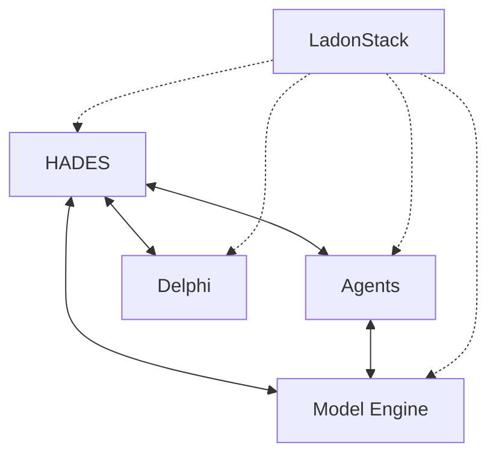

# Project Olympus Build Document

**Version:** 1.0.0  
**Last Updated:** 2025-01-23  
**Status:** Development

## Overview

Project Olympus is an integrated AI system composed of five specialized components working in harmony to provide intelligent data management, autonomous operations, monitoring, and user interaction.

## System Components

### 1. HADES (Heuristic Adaptive Data Extraction System)

Core backend system providing:

- RAG-enabled database operations
- Knowledge graph management
- Vector store integration
- API/MCP server interface
- Memory management tiers (Elysium, Asphodel, Lethe)

### 2. Olympus Agents

Autonomous agent pool handling:

- Task execution and scheduling
- Resource optimization
- System automation
- Continual learning capabilities
- Agent coordination

### 3. Delphi

Unified frontend interface providing:

- User interaction dashboard
- System control panel
- Visualization tools
- Real-time monitoring displays
- Command center functionality

### 4. LadonStack

Comprehensive monitoring system offering:

- System and application metrics
- Log aggregation and analysis
- Distributed tracing
- Alert management
- Health monitoring

### 5. Olympus Model Engine

AI model management system providing:

- Model API and registry
- Inference engine
- Training pipeline
- Model optimization
- Configuration management

## System Architecture

### Component Integration



### Data Flow

1. **User Interactions**
   - Requests enter through Delphi
   - Routed to HADES via MCP
   - Processed by relevant agents
   - Results returned through Delphi

2. **Model Operations**
   - Model requests handled by Engine
   - Inference results to HADES/Agents
   - Training coordinated with Agents
   - Performance monitored by LadonStack

3. **System Monitoring**
   - Metrics collected by LadonStack
   - Logs aggregated centrally
   - Alerts processed by Agents
   - Status displayed in Delphi

## Development Requirements

### System Dependencies

- Python 3.12+
- CUDA 12.1+ (for Model Engine)
- Node.js 20+ (for Delphi)
- Docker & Docker Compose
- GPU support (NVIDIA)

### Core Technologies

1. **Databases**
   - ArangoDB (Knowledge Graph)
   - Vector Store (FAISS/Milvus)
   - Redis (Caching)

2. **AI/ML**
   - PyTorch
   - Transformers
   - vLLM
   - SentenceTransformers

3. **Monitoring**
   - Prometheus
   - Grafana
   - OpenTelemetry
   - ELK Stack

4. **Frontend**
   - React
   - TypeScript
   - Material-UI
   - D3.js

## Development Workflow

### 1. Setup Development Environment

```bash
# Clone repository
git clone https://github.com/your-org/olympus.git
cd olympus

# Create virtual environment
python -m venv venv
source venv/bin/activate

# Install dependencies
pip install -r requirements.txt

# Setup pre-commit hooks
pre-commit install
```

### 2. Component Development

Each component has its own development cycle:

- HADES: Backend services
- Agents: AI operations
- Delphi: Frontend interface
- LadonStack: Monitoring
- Model Engine: AI infrastructure

### 3. Testing Strategy

- Unit tests per component
- Integration tests across components
- End-to-end system tests
- Performance benchmarks
- Security audits

## Deployment

### Local Development

```bash
docker-compose up -d
```

### Production Deployment

- Kubernetes orchestration
- GPU node pools
- Load balancing
- Auto-scaling
- Health monitoring

## Security Considerations

1. **Authentication & Authorization**
   - JWT-based auth
   - Role-based access
   - API key management
   - Session handling

2. **Data Protection**
   - Encryption at rest
   - Secure communication
   - Audit logging
   - Access controls

3. **Monitoring & Alerts**
   - Security event monitoring
   - Intrusion detection
   - Performance anomalies
   - Resource usage alerts

## Documentation

Each component maintains its own detailed documentation:

- Architecture specifications
- API documentation
- Development guides
- Deployment instructions
- Security protocols

## Next Steps

1. **Component Development**
   - Complete HADES core functionality
   - Implement agent framework
   - Develop Delphi interface
   - Configure LadonStack
   - Set up Model Engine

2. **Integration**
   - Component communication
   - Data flow optimization
   - Performance tuning
   - Security implementation

3. **Testing & Deployment**
   - Test automation
   - CI/CD pipeline
   - Deployment automation
   - Monitoring setup

## Contributing

See [CONTRIBUTING.md](CONTRIBUTING.md) for development guidelines and processes.

## License

This project is licensed under [LICENSE](LICENSE).
