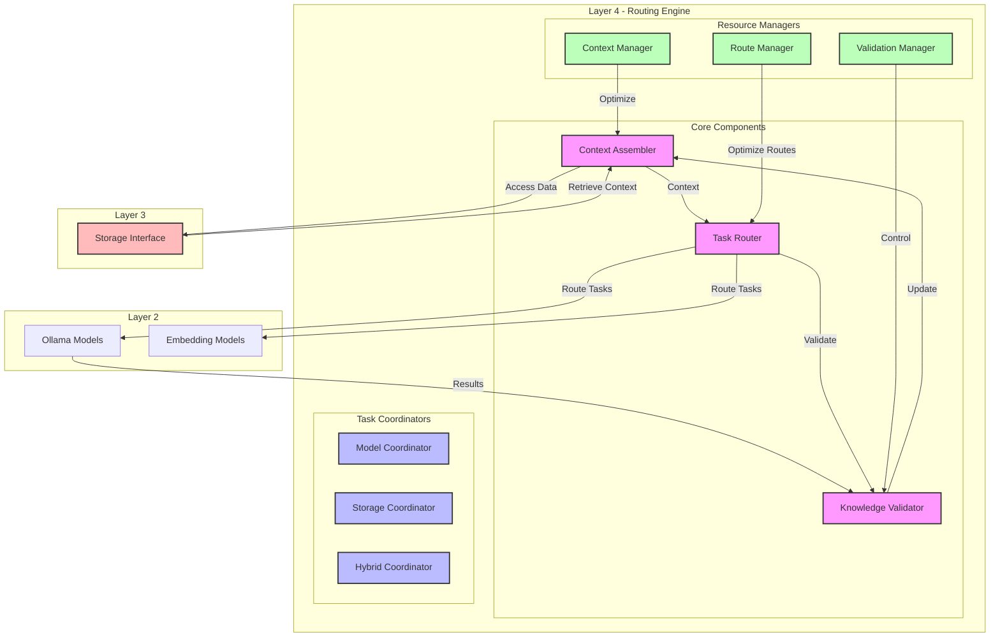

# HADES Routing Layer (Layer 4) Build Document

## Overview

Layer 4 serves as the Routing and Coordination layer in HADES, managing the flow of operations between:

- Layer 2's model operations (inference and embedding generation)
- Layer 3's storage interfaces for efficient knowledge access
- Higher-level orchestration in Layer 5

## Architecture



## Core Responsibilities

1. **Task Routing**
   - Direct tasks to appropriate model endpoints in Layer 2
   - Optimize request distribution based on model availability and load
   - Handle task prioritization and queueing

2. **Context Management**
   - Assemble relevant context from storage interfaces
   - Coordinate data access patterns
   - Optimize context retrieval strategies

3. **Knowledge Coordination**
   - Validate knowledge updates
   - Coordinate between storage interfaces
   - Manage data consistency

4. **Resource Optimization**
   - Balance load across model endpoints
   - Optimize storage interface access
   - Monitor and adjust routing patterns

## Validation & Mediation

Layer 4 now includes the ValidationMediator component moved from Layer 3, responsible for ensuring data integrity and managing trust scores:

### Validation Components

1. **ValidationMediator**
   - Enforces validation rules before committing updates
   - Manages trust scores and their evolution
   - Coordinates with Layer 5 for conflict resolution
   - Handles rollback operations when validation fails

2. **Trust Score Management**
   - Dynamic trust score calculation based on validation results
   - Trust score propagation through graph relationships
   - Trust-based access control for knowledge retrieval
   - Historical trust score tracking and analysis

3. **Transaction Management**
   - ACID compliance for database operations
   - Atomic updates across multiple collections
   - Conflict detection and resolution
   - Rollback coordination with Layer 3

### Implementation Details

```python
class ValidationMediator:
    """Ensures data integrity and manages trust scores."""
    
    async def validate_update(self, update_data: dict) -> bool:
        """Validates an update before it's committed to storage."""
        validation_results = await self._check_validation_rules(update_data)
        trust_score = await self._calculate_trust_score(validation_results)
        return trust_score >= self.min_trust_threshold

    async def _calculate_trust_score(self, validation_results: list) -> float:
        """Calculates trust score based on validation results."""
        weights = {
            'model_confidence': 0.4,
            'historical_accuracy': 0.3,
            'context_relevance': 0.3
        }
        return sum(r.score * weights[r.type] for r in validation_results)

    async def handle_conflict(self, conflict_data: dict):
        """Coordinates with Layer 5 for conflict resolution."""
        resolution = await self.layer5.resolve_conflict(conflict_data)
        if resolution.action == 'rollback':
            await self._initiate_rollback(conflict_data)

class ConflictResolutionMode(Enum):
    STRICT = "strict"    # Rollback everything on failure
    STAGED = "staged"    # Store as pending for review
    SOFT = "soft"       # Apply partial updates

class ValidationMediator:
    async def handle_conflict(self, conflict_data: dict):
        """Enhanced conflict resolution with multiple modes."""
        resolution = await self.layer5.resolve_conflict(conflict_data)
        
        if resolution.mode == ConflictResolutionMode.STRICT:
            await self._initiate_rollback(conflict_data)
        elif resolution.mode == ConflictResolutionMode.STAGED:
            await self._stage_update(conflict_data)
        else:  # SOFT mode
            await self._partially_apply_update(conflict_data)
    
    async def _stage_update(self, conflict_data: dict):
        """Store update as pending for review."""
        await self.db.execute("""
            INSERT {
                data: @update,
                status: 'pending',
                conflicts: @conflicts,
                timestamp: DATE_NOW()
            } INTO pending_updates
        """, {
            'update': conflict_data.update,
            'conflicts': conflict_data.conflicts
        })
    
    async def _partially_apply_update(self, conflict_data: dict):
        """Apply updates that passed validation."""
        valid_updates = [u for u in conflict_data.updates 
                        if u.trust_score >= self.min_trust_threshold]
        
        if valid_updates:
            await self.db.execute("""
                FOR update IN @updates
                    INSERT update INTO knowledge_graph
            """, {'updates': valid_updates})

class TrustScoreMonitor:
    """Monitors trust scores for anomalies and systemic issues."""
    
    async def detect_anomalies(self):
        """Detects sudden drops in trust scores."""
        anomalies = await self.db.execute("""
            FOR doc IN knowledge_graph
                FILTER doc.trust_score < @min_threshold
                    AND doc.last_updated > DATE_SUBTRACT(DATE_NOW(), "day", 7)
                COLLECT model = doc.model_source
                AGGREGATE 
                    count = COUNT(),
                    avg_trust = AVG(doc.trust_score),
                    std_dev = STDDEV(doc.trust_score)
                FILTER count >= @min_anomaly_count
                RETURN {
                    model,
                    count,
                    avg_trust,
                    std_dev,
                    severity: (0.9 - avg_trust) * count
                }
        """, {
            'min_threshold': 0.3,
            'min_anomaly_count': 50
        })
        
        if anomalies:
            await self._handle_anomalies(anomalies)
    
    async def _handle_anomalies(self, anomalies: list):
        """Responds to detected anomalies."""
        for anomaly in anomalies:
            if anomaly['severity'] > 100:
                # Critical: Notify Layer 5 immediately
                await self.layer5.report_critical_anomaly(anomaly)
            elif anomaly['severity'] > 50:
                # Warning: Flag for review
                await self.layer5.report_anomaly_warning(anomaly)
            else:
                # Monitor: Log for tracking
                await self.layer5.log_anomaly(anomaly)
```

## Storage Integration

Layer 4 interacts with ArangoDB through Layer 3's interfaces:

```python
from typing import Dict, Any
from aioarangodb import ArangoClient

class StorageInterface:
    """Interface for ArangoDB operations through Layer 3."""
    
    def __init__(self, client: ArangoClient):
        self.client = client
        self.db = client.db('hades')
        
    async def store_knowledge(self, data: Dict[str, Any]) -> bool:
        """Store validated knowledge in ArangoDB."""
        try:
            # Store in appropriate collection based on data type
            if 'embedding' in data:
                await self.db.collection('embeddings').insert(data)
            elif 'graph' in data:
                await self.db.collection('knowledge_graph').insert(data)
            else:
                await self.db.collection('documents').insert(data)
            return True
        except Exception as e:
            logger.error(f"Storage error: {e}")
            return False

    async def retrieve_context(self, query: Dict[str, Any]) -> Dict[str, Any]:
        """Retrieve context from ArangoDB using ArangoSearch."""
        try:
            # Use ArangoSearch view for semantic search
            results = await self.db.view('semantic_view').search(query)
            return self._process_results(results)
        except Exception as e:
            logger.error(f"Retrieval error: {e}")
            return {}
```

### Query Optimization

Layer 4 uses ArangoDB's built-in features for efficient querying:

```python
class QueryOptimizer:
    """Optimizes queries for ArangoDB."""
    
    async def optimize_query(self, query: Dict[str, Any]) -> Dict[str, Any]:
        """Apply query optimizations."""
        # Use ArangoDB's native query optimizer
        optimized = {
            'sort': ['SORT doc.timestamp DESC'],
            'limit': 100,
            'cache': True,
            'fullCount': True,
            'optimizer': {
                'rules': ['-all', '+use-indexes']
            }
        }
        return {**query, **optimized}
```

### Storage Configuration

Layer 4 relies on the storage configuration defined in L1_hardware.md:

```python
class StorageConfig:
    """Storage configuration for ArangoDB."""
    
    def __init__(self):
        # Use paths from L1_hardware.md
        self.graph_vector_path = "/var/lib/arangodb3/graph_vector"  # RAID0
        self.document_path = "/var/lib/arangodb3/document"          # RAID1
        self.cache_path = "/var/lib/arangodb3/cache"               # tmpfs
        
    def get_collection_config(self, collection_type: str) -> Dict[str, Any]:
        """Get configuration for a collection type."""
        configs = {
            'embeddings': {
                'path': self.graph_vector_path,
                'compression': True,
                'cache_enabled': True
            },
            'knowledge_graph': {
                'path': self.graph_vector_path,
                'compression': True,
                'cache_enabled': True
            },
            'documents': {
                'path': self.document_path,
                'compression': True,
                'cache_enabled': False
            }
        }
        return configs.get(collection_type, {})
```

## Model Architecture

HADES implements two distinct model architectures:

### 1. Judge Models (Embedding-based Validation)

The three judge models (Minos, Rhadamanthus, Aeacus) use CPU-based embedding with LLM-KG fusion:

```python
from typing import Dict, Any
import numpy as np
from sentence_transformers import SentenceTransformer

class JudgeModelManager:
    """Manages the three CPU-based judge models."""
    
    def __init__(self):
        self.minos = self._init_judge("minos")        # Document validation
        self.rhadamanthus = self._init_judge("rhad")  # Graph validation
        self.aeacus = self._init_judge("aeacus")      # Embedding validation
        
    def _init_judge(self, judge_name: str) -> SentenceTransformer:
        """Initialize a CPU-based judge model."""
        model = SentenceTransformer(f'hades/judge_{judge_name}')
        model.to('cpu')  # Ensure CPU execution
        return model
        
    async def get_validation(self, data: Dict[str, Any]) -> Dict[str, bool]:
        """Get validation decisions from all judges."""
        return {
            'document': await self._validate_with_minos(data),
            'graph': await self._validate_with_rhadamanthus(data),
            'embedding': await self._validate_with_aeacus(data)
        }

class NegativeSampler:
    """Implements diffusion-based negative sampling for judge models."""
    
    def sample_negatives(self, positive_examples: np.ndarray) -> np.ndarray:
        """Generate negative samples using diffusion process."""
        # Implementation from llm_kg_fusion_implementation.md
        pass
```

### 2. Hades Frontend Model (InCA/ECL)

The main Hades model implements InCA/ECL for continuous learning:

```python
from typing import Dict, Any, List
from dataclasses import dataclass

@dataclass
class HadesContext:
    """Context structure for Hades model."""
    query_tags: List[str]
    class_distributions: Dict[str, np.ndarray]
    accumulated_context: Dict[str, Any]
    context_score: float

class HadesModel:
    """Frontend model implementing InCA/ECL architecture."""
    
    def __init__(self, llm, external_learner):
        self.llm = llm  # Main LLM for inference
        self.ecl = external_learner  # External Continual Learner
        self.tag_generator = TagGenerator(llm)
        self.gaussian_model = GaussianModel()
        
    async def process_query(self, query: str, session_id: str) -> Dict[str, Any]:
        """Process query using InCA/ECL architecture."""
        # Stage 1: Generate contextual tags
        tags = await self.tag_generator.generate_tags(query)
        
        # Stage 2: Update class distributions
        class_dists = await self.gaussian_model.update_distributions(tags)
        
        # Stage 3: Accumulate context
        context = await self.ecl.accumulate_context(
            query=query,
            tags=tags,
            distributions=class_dists
        )
        
        # Generate response
        response = await self.llm.generate(
            prompt=query,
            context=context
        )
        
        # Update ECL with response
        await self.ecl.update(
            query=query,
            response=response,
            context=context
        )
        
        return {
            'response': response,
            'context': context,
            'metadata': {
                'tags': tags,
                'distributions': class_dists
            }
        }
```

## Layer Interaction Patterns

1. **With Layer 2 (Model Engine)**
   - Route inference requests to appropriate models
   - Coordinate batch operations
   - Monitor model availability and performance

2. **With Layer 3 (Database)**
   - Coordinate access to storage interfaces:
     - Use ArangoDB for efficient data retrieval
   - Optimize data retrieval patterns

3. **With Layer 5 (Orchestration)**
   - Receive high-level routing policies
   - Report routing metrics and statistics
   - Implement orchestration decisions

## Layer Integration

The two model architectures are integrated but serve different purposes:

1. **Judge Models**:
   - Validate knowledge updates
   - Ensure data consistency
   - Manage trust scores
   - CPU-optimized for efficient validation
   - Use LLM-KG fusion with negative sampling
   - Managed by Layer 2 (Model Engine)

2. **Hades Model**:
   - Handles user interactions
   - Accumulates context over time
   - Learns continuously from interactions
   - GPU-optimized for fast inference
   - Uses InCA/ECL architecture
   - Managed by Layer 4 (Routing)

### Integration Flow

```python
class ModelOrchestrator:
    """Orchestrates interaction between Hades and Judge models."""
    
    def __init__(self):
        self.hades = HadesModel()
        self.judges = JudgeModelManager()
        
    async def process_user_query(self, query: str, session_id: str) -> Dict[str, Any]:
        """Process user query through Hades."""
        return await self.hades.process_query(query, session_id)
        
    async def validate_knowledge(self, data: Dict[str, Any]) -> bool:
        """Validate knowledge through judge models."""
        validations = await self.judges.get_validation(data)
        return all(validations.values())
        
    async def update_knowledge(self, session_data: Dict[str, Any]) -> None:
        """Update knowledge if validation passes."""
        if await self.validate_knowledge(session_data):
            await self.hades.ecl.update_knowledge(session_data)
```

### Memory Management

```python
class MemoryManager:
    """Manages different memory types across models."""
    
    def __init__(self):
        self.hades_memory = {}  # InCA/ECL memory
        self.judge_memory = {}  # Embedding model memory
        
    async def update_hades_memory(self, session_id: str, data: Dict[str, Any]):
        """Update Hades' InCA/ECL memory."""
        if session_id not in self.hades_memory:
            self.hades_memory[session_id] = []
        self.hades_memory[session_id].append(data)
        
    async def update_judge_memory(self, key: str, embeddings: np.ndarray):
        """Update judge models' memory."""
        self.judge_memory[key] = embeddings
```

## Components

### 1. Context Assembler

```python
from typing import List, Dict, Any
from dataclasses import dataclass

@dataclass
class ContextWindow:
    """Represents a dynamic context window for model inference."""
    content: List[Dict[str, Any]]
    metadata: Dict[str, Any]
    priority_score: float
    token_count: int
    model_context: Dict[str, Any]  # Specific context for model type
    
class ContextAssembler:
    """Assembles relevant context for model inference."""
    
    async def build_context(
        self,
        query: str,
        model_type: str,
        max_tokens: int = 4096
    ) -> ContextWindow:
        """Build context window for a model query."""
        # 1. Get relevant documents
        docs = await self.db.search_relevant(query)
        
        # 2. Score and prioritize based on model type
        scored_docs = await self.prioritizer.score_documents(
            docs,
            query,
            model_type
        )
        
        # 3. Optimize for model's token limit
        selected_docs = self.optimizer.fit_to_window(
            scored_docs,
            max_tokens,
            model_type
        )
        
        # 4. Assemble window with model-specific context
        return ContextWindow(
            content=selected_docs,
            metadata=self._extract_metadata(selected_docs),
            priority_score=self._calculate_priority(selected_docs),
            token_count=self._count_tokens(selected_docs),
            model_context=self._get_model_context(model_type)
        )
```

### 2. Task Router

```python
from enum import Enum
from typing import Optional

class TaskType(Enum):
    MODEL_INFERENCE = "model_inference"
    KNOWLEDGE_VALIDATION = "knowledge_validation"
    FACT_CHECKING = "fact_checking"
    KNOWLEDGE_SYNTHESIS = "knowledge_synthesis"

class TaskRouter:
    """Routes tasks to appropriate model instances."""
    
    async def route_task(
        self,
        task: Dict[str, Any]
    ) -> str:
        """Route task to appropriate model and processor."""
        task_type = self._determine_task_type(task)
        model_requirements = self._get_model_requirements(task)
        
        # Select appropriate model instance
        model = await self.model_pool.get_suitable_model(
            task_type,
            model_requirements
        )
        
        # Prepare inference context
        context = await self.context_assembler.build_context(
            task["query"],
            model.type
        )
        
        # Execute inference
        return await self.inference_executor.run(
            model,
            task,
            context
        )
```

### 3. Knowledge Validator

```python
from dataclasses import dataclass
from typing import List, Optional

@dataclass
class ValidationResult:
    """Result of model output validation."""
    is_valid: bool
    confidence: float
    supporting_evidence: List[str]
    conflicting_evidence: List[str]
    model_metadata: Dict[str, Any]
    suggested_updates: Optional[Dict[str, Any]] = None

class KnowledgeValidator:
    """Validates model outputs and knowledge updates."""
    
    async def validate_model_output(
        self,
        output: Dict[str, Any],
        context: Dict[str, Any],
        model_info: Dict[str, Any]
    ) -> ValidationResult:
        """Validate a model's output."""
        # Validate based on model type and context
        validations = await self._gather_validations(
            output,
            context,
            model_info
        )
        
        # Check for output consistency
        consistency = await self._check_output_consistency(
            output,
            model_info
        )
        
        # Analyze evidence considering model type
        evidence = self._analyze_evidence(
            validations,
            model_info
        )
        
        return ValidationResult(
            is_valid=consistency.is_valid,
            confidence=consistency.confidence,
            supporting_evidence=evidence.supporting,
            conflicting_evidence=evidence.conflicting,
            model_metadata=model_info,
            suggested_updates=self._generate_suggestions(validations)
        )
```

## Model Integration

### Ollama Integration Strategy

1. **Embedding Models Configuration**
   - Primary Embedding Model: Using `ollama.completions` for consistent vector generation
   - Context Embedding Model: Using `ollama.completions` with specialized prompts for context understanding
   - Validation Embedding Model: Using `ollama.chat` for interactive validation checks

2. **Model Selection Rationale**
   - Completions API for embeddings due to:
     - More deterministic output format
     - Better control over token generation
     - Optimized for single-pass operations
   - Chat API for validation due to:
     - Better handling of multi-turn reasoning
     - Support for system prompts in validation rules
     - More natural for interactive verification

3. **Recursive Feedback Pattern**

   ```python
   from langchain_ollama import ChatOllama, OllamaLLM
   from dataclasses import dataclass
   from typing import Dict, Any, List
   
   @dataclass
   class FeedbackLoop:
       """Manages recursive feedback between LLM and database."""
       primary_embedder: OllamaLLM
       context_embedder: OllamaLLM
       validator: ChatOllama
       
       async def process_with_feedback(
           self,
           query: str,
           context: Dict[str, Any]
       ) -> Dict[str, Any]:
           """Process query with recursive feedback loop."""
           # Initial embedding
           initial_embedding = await self.primary_embedder.embed_query(query)
           
           # Get database context
           db_context = await self.get_db_context(initial_embedding)
           
           # Enhance context
           enhanced_context = await self.context_embedder.embed_documents(
               documents=db_context,
               query_embedding=initial_embedding
           )
           
           # Validate and refine
           validation_result = await self.validator.chat.completions.create(
               messages=[
                   {"role": "system", "content": "Validate context relevance"},
                   {"role": "user", "content": str(enhanced_context)}
               ]
           )
           
           # Recursive refinement if needed
           if needs_refinement(validation_result):
               return await self.refine_and_reprocess(
                   query,
                   enhanced_context,
                   validation_result
               )
           
           return {
               "embedding": initial_embedding,
               "context": enhanced_context,
               "validation": validation_result
           }
   ```

4. **Layer 5 Integration Points**
   - Feedback results are passed to Layer 5 for orchestration
   - Layer 5 can trigger reprocessing based on higher-level context
   - Validation results inform Layer 5's learning mechanisms

## Model Configuration

```python
from langchain_ollama import ChatOllama, OllamaLLM
from typing import Dict

class ModelConfig:
    """Configure and manage Ollama models."""
    
    @staticmethod
    def get_embedding_model(model_type: str) -> OllamaLLM:
        """Get appropriate embedding model configuration."""
        configs: Dict[str, Dict] = {
            "primary": {
                "model": "llama2",
                "temperature": 0.0,
                "num_ctx": 4096
            },
            "context": {
                "model": "llama2",
                "temperature": 0.1,
                "num_ctx": 8192
            },
            "validator": {
                "model": "llama2",
                "temperature": 0.2,
                "num_ctx": 4096
            }
        }
        
        return OllamaLLM(**configs[model_type])
    
    @staticmethod
    def get_chat_model() -> ChatOllama:
        """Get chat model for validation."""
        return ChatOllama(
            model="llama2",
            temperature=0.3,
            streaming=True
        )
```

## Performance Considerations

1. **Context Window Optimization**
   - Use sliding windows for large contexts
   - Implement token-based truncation
   - Cache frequently used contexts

2. **Task Routing Efficiency**
   - Maintain agent load statistics
   - Use predictive routing based on task patterns
   - Implement priority queues for critical tasks

3. **Validation Performance**
   - Parallel validation by multiple agents
   - Caching of validation results
   - Progressive validation levels

## Monitoring and Metrics

```python
class InferenceMetrics:
    """Metrics for Layer 4 operations."""
    
    async def collect_metrics(self) -> Dict[str, float]:
        """Collect current metrics."""
        return {
            # Context metrics
            "context_build_time_ms": self.context_timer.average(),
            "context_cache_hit_rate": self.cache_monitor.hit_rate(),
            "avg_context_size_tokens": self.context_monitor.avg_size(),
            
            # Routing metrics
            "routing_latency_ms": self.router_monitor.latency(),
            "agent_utilization": self.agent_monitor.utilization(),
            "task_queue_length": self.queue_monitor.length(),
            
            # Validation metrics
            "validation_success_rate": self.validator_monitor.success_rate(),
            "validation_confidence_avg": self.validator_monitor.avg_confidence(),
            "consensus_time_ms": self.consensus_monitor.average_time()
        }
```

## Integration Guidelines

1. **With Layer 3 (Database)**
   - Use asynchronous database operations
   - Implement connection pooling
   - Cache frequent queries

2. **With Layer 5 (Orchestration)**
   - Provide clear task status updates
   - Implement retry mechanisms
   - Handle priority overrides

3. **With Layer 2 (Model Engine)**
   - Optimize batch operations
   - Share context across related tasks
   - Monitor model performance

## Error Handling

```python
class InferenceError(Exception):
    """Base class for inference layer errors."""
    pass

class ContextBuildError(InferenceError):
    """Error in context building."""
    pass

class RoutingError(InferenceError):
    """Error in task routing."""
    pass

class ValidationError(InferenceError):
    """Error in knowledge validation."""
    pass

async def handle_error(
    error: Exception,
    context: Dict[str, Any]
) -> None:
    """Handle errors in Layer 4."""
    if isinstance(error, ContextBuildError):
        await self._handle_context_error(error, context)
    elif isinstance(error, RoutingError):
        await self._handle_routing_error(error, context)
    elif isinstance(error, ValidationError):
        await self._handle_validation_error(error, context)
    else:
        await self._handle_unknown_error(error, context)
```

## Testing Strategy

1. **Unit Tests**
   - Test each component in isolation
   - Mock external dependencies
   - Test error handling paths

2. **Integration Tests**
   - Test component interactions
   - Verify cross-layer communication
   - Test end-to-end flows

3. **Performance Tests**
   - Measure latency under load
   - Test concurrent operations
   - Verify resource usage

## Deployment Considerations

1. **Scaling**
   - Horizontal scaling of agent pools
   - Vertical scaling for context processing
   - Cache distribution

2. **Monitoring**
   - Real-time metrics collection
   - Performance anomaly detection
   - Resource usage tracking

3. **Security**
   - Input validation
   - Agent authentication
   - Secure communication channels
