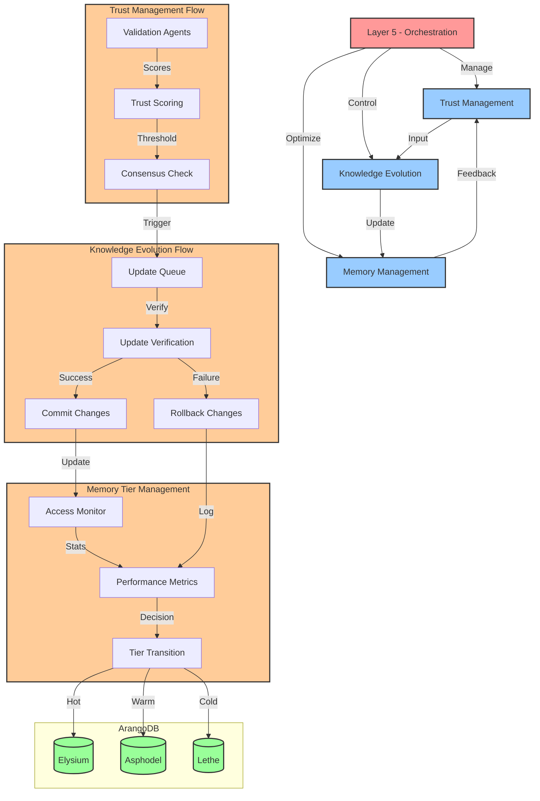

# HADES Orchestration Layer (Layer 5) Build Document

## Overview

Layer 5 serves as the orchestration layer in HADES, coordinating system components and managing knowledge evolution workflows. It leverages ArangoDB's AQL for unified operations across the three-tier memory system.

## Orchestration Flow



## Core Responsibilities

1. **Trust Management**
   - Score and validate new knowledge
   - Maintain trust thresholds across memory tiers
   - Coordinate validation agents

2. **Knowledge Evolution**
   - Manage feedback loops
   - Coordinate KG updates
   - Oversee memory tier transitions

3. **Resource Optimization**
   - Balance load across memory tiers
   - Coordinate system components
   - Optimize query execution

## AQL Implementation

### 1. Trust Scoring and Validation

```aql
// Trust-based Knowledge Validation
FOR vertex IN knowledge_graph
    FILTER vertex.pending_validation == true
    LET validation_score = (
        FOR agent IN validation_agents
            FILTER agent.status == 'active'
            LET agent_score = (
                RETURN agent.validate(vertex)
            )
            RETURN AVERAGE(agent_score)
    )
    UPDATE vertex WITH {
        trust_score: validation_score[0],
        validated: validation_score[0] >= @trustThreshold,
        pending_validation: false
    } IN knowledge_graph
    OPTIONS { waitForSync: true }
```

### 2. Knowledge Evolution Management

```aql
// Adaptive Knowledge Update
FOR update IN knowledge_updates
    FILTER update.status == 'pending'
    LET existing = (
        FOR vertex IN knowledge_graph
            FILTER vertex._key == update.target_key
            RETURN vertex
    )
    LET trust_delta = ABS(update.trust_score - existing[0].trust_score)
    LET should_update = trust_delta >= @updateThreshold
    
    FILTER should_update
    UPDATE existing[0] WITH {
        trust_score: update.trust_score,
        last_updated: DATE_NOW(),
        update_source: update.source
    } IN knowledge_graph
```

### 3. Memory Tier Orchestration

```aql
// Dynamic Tier Management
FOR doc IN unified_collection
    LET access_metrics = {
        frequency: doc.access_count / (DATE_DIFF(doc.created_at, DATE_NOW(), "d") + 1),
        recency: DATE_DIFF(doc.last_access, DATE_NOW(), "h"),
        trust: doc.trust_score
    }
    
    LET target_tier = (
        CASE
            WHEN access_metrics.frequency >= @hotThreshold 
                 AND access_metrics.trust >= @trustThreshold 
                THEN 'elysium'
            WHEN access_metrics.recency <= @warmThreshold 
                THEN 'asphodel'
            ELSE 'lethe'
        END
    )
    
    FILTER doc.current_tier != target_tier
    UPDATE doc WITH {
        current_tier: target_tier,
        tier_transition_date: DATE_NOW()
    } IN unified_collection
```

## Error Handling and Recovery

### 1. Validation Failure Recovery

```aql
// Rollback Failed Updates
FOR update IN knowledge_updates
    FILTER update.status == 'failed'
    LET backup = (
        FOR backup IN backup_collection
            FILTER backup.original_key == update.target_key
            SORT backup.timestamp DESC
            LIMIT 1
            RETURN backup
    )
    
    UPDATE { _key: update.target_key } 
    WITH {
        content: backup[0].content,
        trust_score: backup[0].trust_score,
        rollback_source: update._key
    } IN knowledge_graph
```

### 2. Consistency Checks

```aql
// Periodic Trust Score Validation
FOR vertex IN knowledge_graph
    LET connected_trust = (
        FOR v, e IN 1..1 OUTBOUND vertex GRAPH 'knowledge_graph'
            RETURN v.trust_score
    )
    
    LET avg_connected_trust = AVERAGE(connected_trust)
    LET trust_deviation = ABS(vertex.trust_score - avg_connected_trust)
    
    FILTER trust_deviation > @deviationThreshold
    
    UPDATE vertex WITH {
        requires_validation: true,
        trust_anomaly: trust_deviation
    } IN knowledge_graph
```

## System Requirements

- ArangoDB 3.12+
- Python 3.11+
- Python-arango driver
- Linux OS (tested on Ubuntu 22.04)

## Configuration

```yaml
orchestration:
  trust:
    min_threshold: 0.85
    update_threshold: 0.1
    deviation_threshold: 0.2
  
  memory_tiers:
    hot_threshold: 0.75
    warm_threshold: 48  # hours
    
  validation:
    min_agents: 3
    consensus_threshold: 0.66
    
  performance:
    max_concurrent_updates: 100
    batch_size: 50
```

## Implementation Notes

1. **Trust Scoring**
   - Use weighted averages from multiple validation agents
   - Consider historical accuracy of agents
   - Implement exponential decay for trust scores

2. **Knowledge Evolution**
   - Maintain audit trail of all updates
   - Use transaction blocks for atomic updates
   - Implement rollback mechanisms

3. **Memory Management**
   - Use AQL for efficient tier transitions
   - Implement background jobs for tier optimization
   - Monitor and log tier transition metrics

## Next Steps

1. Implement validation agent framework
2. Set up monitoring for trust score distribution
3. Create automated tier transition jobs
4. Develop recovery procedures for failed updates
