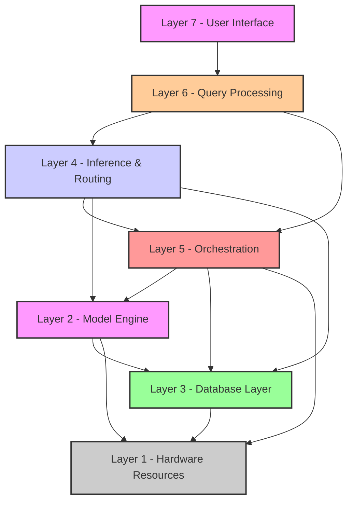

# HADES Layer Architecture

## Layer Descriptions

1. **Layer 7 - User Interface**
   - Handles user interactions
   - Presents system outputs
   - Manages user sessions

2. **Layer 6 - Query Processing**
   - Processes incoming queries
   - Routes requests to appropriate components
   - Formats responses

3. **Layer 4 - Inference & Routing**
   - Orchestrates task distribution
   - Manages inference operations
   - Handles routing logic

4. **Layer 5 - Orchestration**
   - Coordinates system components
   - Manages workflows
   - Ensures resource optimization

5. **Layer 2 - Model Engine**
   - Handles AI model operations
   - Manages tensor computations
   - Processes embeddings

6. **Layer 3 - Database Layer**
   - Manages data storage and retrieval
   - Handles graph operations
   - Optimizes queries

7. **Layer 1 - Hardware Resources**
   - Controls physical resources
   - Manages computational capacity
