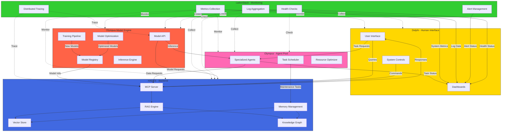

# Project Olympus Architecture

## System Overview

## Component Responsibilities

### HADES (Backend)
- **MCP Server**: Message Control Protocol server for handling all external communications
- **RAG Engine**: Retrieval Augmented Generation for intelligent query processing
- **Vector Store**: Efficient storage and retrieval of embeddings
- **Knowledge Graph**: Relationship and context management
- **Memory Management**: Tiered data lifecycle management (Elysium, Asphodel, Lethe)

### Olympus (Agent Pool)
- **Specialized Agents**: Task-specific AI agents for system operations
- **Task Scheduler**: Orchestration of system tasks
- **Resource Optimizer**: System resource optimization

### Delphi (Human Interface)
- **User Interface**: Primary interaction point for users
- **Dashboards**: Real-time visualization
- **System Controls**: Configuration and control interface

### LadonStack (Monitoring)
- **Metrics Collection**: System and application metrics gathering
- **Log Aggregation**: Centralized logging system
- **Distributed Tracing**: Request tracing across components
- **Alert Management**: Intelligent alerting system
- **Health Checks**: Component and system health monitoring

### Olympus Model Engine
- **Model API**: Unified interface for model operations
- **Model Registry**: Central repository for model management
- **Inference Engine**: Optimized inference execution
- **Training Pipeline**: Model training and fine-tuning
- **Model Optimization**: Quantization and optimization tools

## Integration Notes

### Model Engine Decoupling
The current model management functionality in HADES may need to be decoupled and integrated with the Olympus Model Engine in the future. This decision will be based on:

1. **Operational Requirements**
   - Performance needs
   - Resource utilization
   - Scaling patterns

2. **Architectural Considerations**
   - Service boundaries
   - Data flow patterns
   - System coupling

3. **Migration Strategy**
   - Gradual transition
   - Backward compatibility
   - Service discovery

The decoupling process will be evaluated based on system usage patterns and performance requirements.
