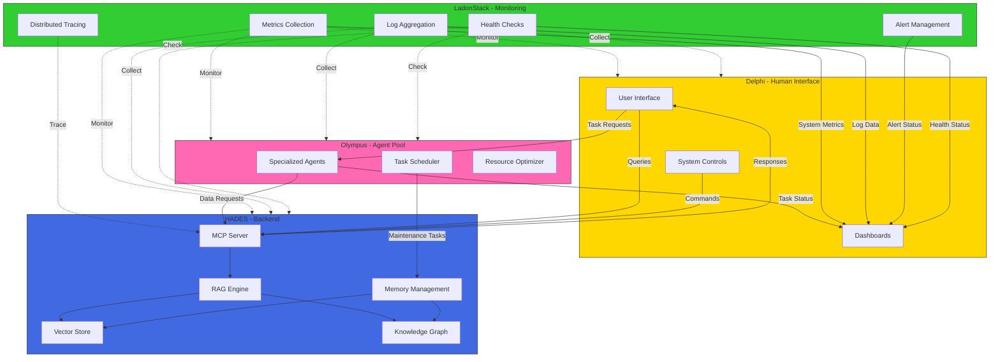

# Project Olympus Architecture

## System Overview

## Component Responsibilities

### HADES (Backend)
- **MCP Server**: Message Control Protocol server for handling all external communications
- **RAG Engine**: Retrieval Augmented Generation for intelligent query processing
- **Vector Store**: Efficient storage and retrieval of embeddings
- **Knowledge Graph**: Relationship and context management
- **Memory Management**: Tiered data lifecycle management (Elysium, Asphodel, Lethe)

### Olympus (Agent Pool)
- **Specialized Agents**: Task-specific AI agents for system operations
- **Task Scheduler**: Orchestration of system tasks
- **Resource Optimizer**: System resource optimization

### Delphi (Human Interface)
- **User Interface**: Primary interaction point for users
- **Dashboards**: Real-time visualization
- **System Controls**: Configuration and control interface

### LadonStack (Monitoring)
- **Metrics Collection**: System and application metrics gathering
- **Log Aggregation**: Centralized logging system
- **Distributed Tracing**: Request tracing across components
- **Alert Management**: Intelligent alerting system
- **Health Checks**: Component and system health monitoring

## Data Flow

1. **User Interaction Flow**
   - User submits query through Delphi UI
   - Request routed to HADES via MCP
   - RAG engine processes query using Vector Store and Knowledge Graph
   - Response returned through MCP to UI

2. **System Management Flow**
   - Olympus agents handle system operations
   - LadonStack monitors all components
   - Metrics and logs collected centrally
   - Alerts trigger automated responses

3. **Memory Management Flow**
   - New data enters through Elysium
   - Aging data moves to Asphodel
   - Archived data stored in Lethe
   - Performance metrics tracked by LadonStack

## Communication Protocols

1. **External Communication**
   - REST APIs for synchronous requests
   - WebSocket for real-time updates
   - GraphQL for complex data queries

2. **Internal Communication**
   - MCP for inter-component messaging
   - gRPC for high-performance internal calls
   - OpenTelemetry for monitoring data

3. **Monitoring Protocols**
   - Prometheus metrics format
   - OpenTelemetry tracing
   - Structured logging (JSON)
   - SNMP for network monitoring

## Security Model

1. **Authentication**
   - JWT-based user authentication
   - API key management for services
   - Role-based access control

2. **Data Protection**
   - End-to-end encryption
   - Secure WebSocket connections
   - Encrypted data at rest

3. **Monitoring Security**
   - Secure metrics collection
   - Encrypted log transport
   - Authenticated monitoring endpoints
   - Audit logging
