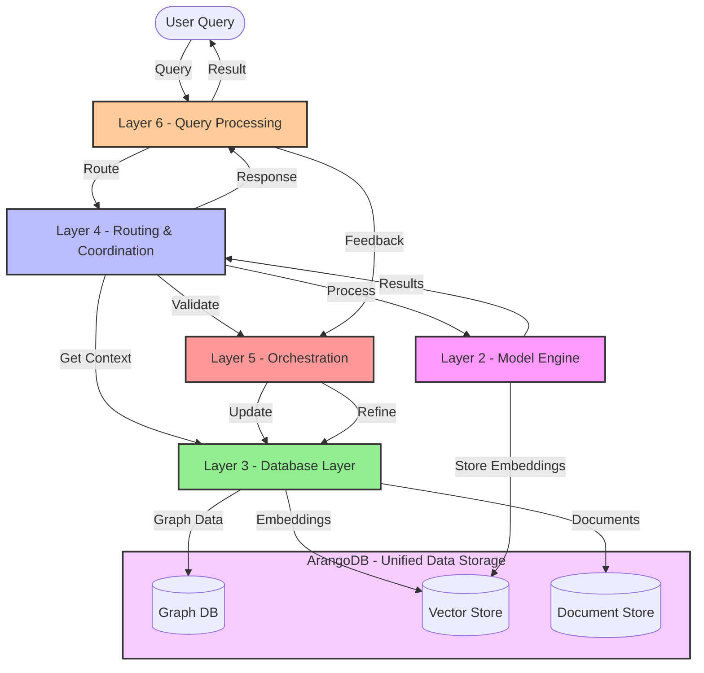

# LLM and Knowledge Graph Fusion: Implementation Guide for HADES

## Overview

This document details how LLMs and Knowledge Graphs (KGs) are integrated into HADES, mapping their roles to the existing layered architecture. It provides an actionable implementation roadmap for embedding, retrieval, validation, and knowledge updating processes.

## Core Concepts and Layer Mapping

The LLM-KG fusion strategy aligns with HADES's layered design. Below is a breakdown of where each component fits.

| **Concept**                  | **Layer Placement** | **Build Document**                | **Implementation Notes**        |
|------------------------------|---------------------|---------------------------------|--------------------------------|
| **Triple Context Restoration (TCR)** | Layer 3 (Database) | `L3_database_layer_build.md` | Ensures knowledge consistency by linking extracted triples to their source context. |
| **Diffusion-Based Negative Sampling** | Layer 2 (Model Engine) | `L2_model_engine_build.md` | Improves LLM embedding quality by refining training with better negative examples. |
| **Multi-Agent Error Detection** | Layer 4 (Routing & Coordination) | `L4_routing_layer_build.md` | Coordinates validation agents and routes updates through the system. |
| **Knowledge Expansion Feedback Loops** | Layer 5 (Orchestration) | `L5_orchestration_layer_build.md` | Governs trust scoring, error correction, and KG updates. |

## Logic Flow Diagram

Below is the **Mermaid diagram** showing how queries and updates flow through the HADES architecture, with **ArangoDB** managing database synchronization.

## Layer-Specific Implementation Details

### **Layer 2 - Model Engine (Inference & Embeddings)**

- Performs **model inference and embedding generation**
- Uses **Diffusion-Based Negative Sampling** to improve retrieval accuracy
- Handles all **model operations and computations**

### **Layer 3 - Database (Storage & Context)**

- Implements **Triple Context Restoration (TCR)**
- Manages the three-tier storage system (Elysium, Asphodel, Lethe)
- Handles all forms of data persistence and retrieval

### **Layer 4 - Routing & Coordination**

- Routes requests between layers based on task requirements
- Coordinates **multi-agent validation** processes
- Manages data flow between storage, models, and orchestration
- Ensures efficient task distribution and execution
- Maintains system coherence through proper routing patterns

### **Layer 5 - Orchestration (Trust & Evolution)**

- Governs **trust scoring of new knowledge**.
- Implements **adaptive KG evolution based on user feedback**.
- Handles **feedback loops to refine system behavior over time**.

## Implementation Roadmap

### **Phase 1: Core KG-LLM Integration**

✅ Implement **basic KG retrieval & model inference**.  
✅ Establish **negative sampling for embeddings**.  
✅ Create **TCR mechanism for restoring lost knowledge context**.

### **Phase 2: Advanced Error Handling & Validation**

✅ Deploy **multi-agent validation** to detect and reject bad KG updates.  
✅ Implement **feedback-based knowledge updates**.  
✅ Integrate **trust scoring for autonomous validation**.

### **Phase 3: Optimization & Scaling**

⏳ Optimize **query efficiency and retrieval selection**.  
⏳ Scale up **negative sampling mechanisms** for more robust embeddings.  
⏳ Improve **dynamic memory allocation and knowledge persistence**.

## Conclusion

This guide defines how **LLMs and Knowledge Graphs integrate into HADES**. By structuring **retrieval, validation, and updates** across multiple layers, HADES ensures **adaptive, reliable, and scalable knowledge evolution**. The next steps involve:

1. **Finalizing Layer 4's inference and validation framework.**
2. **Starting the Layer 5 build document for orchestration.**
3. **Ensuring alignment between retrieval logic and trust mechanisms.**

This document now serves as a **direct implementation reference** for HADES's build documents. 🚀
