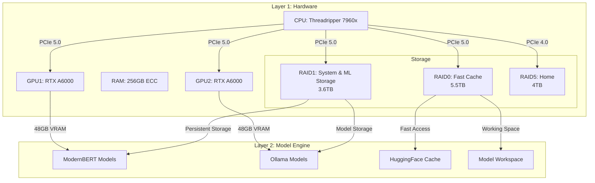

# Layer 1: Hardware Infrastructure

## System Specifications

### Core Components

- **Motherboard**: ASRock TRX50 WS
- **CPU**: AMD Threadripper 7960x
- **RAM**: 256GB ECC RDIMM
- **GPUs**: 2× NVIDIA RTX A6000 (48GB VRAM each)
- **Power**: Seasonic Prime PX-1600 (1600W 80+ Platinum)
- **Case**: Fractal Meshify 2XL Full Tower ATX

### Storage Layout

#### Boot Configuration

- **Boot Drive**: USB Drive
  - `/boot` and `/boot/efi`
  - Minimal root filesystem
  - Essential system files

#### RAID Arrays

1. **RAID0 (High-Speed Cache)** - md127
   - 3× 1.8TB NVMe Gen4 SSDs
   - Total: 5.5TB
   - Mount Points:
     - `/opt/ml/cache` (HuggingFace Cache, 1.46TB)
     - `/opt/ml/workspace` (ML Workspace, 1TB)
     - `/var/cache` (System Cache, 200GB)
     - `/usr/share/ollama/.ollama` (Ollama Models, 850GB)
     - `/swap` (Swap Space, 48GB)

2. **RAID1 (System & ML Storage)** - md126
   - 2× 3.6TB NVMe Gen5 SSDs
   - Total: 3.6TB
   - Mount Points:
     - `/var/lib` (System Libraries)
     - `/var/log` (System Logs)
     - `/etc` (System Configuration)
     - `/opt/ml/models` (ML Model Storage)
     - `/opt/olympus` (HADES System)

3. **RAID5 (Home)** - md125
   - 5× 1TB NVMe Gen4 SSDs
   - Total: 4TB usable
   - Mount Points:
     - `/home` (User Directories)
     - `/opt/ml/projects` (Development Workspace)

4. **RAID6 (Cold Storage)** - planned
   - 4× 20TB HDDs
   - Total: 60TB raw, 40TB usable
   - Mount Points:
     - `/mnt/archive` (Long-term Storage)
     - `/mnt/backup` (System Backups)
     - `/mnt/datasets` (Large Dataset Storage)

#### Logical Volume Management

```text
Volume Groups:
1. vg_fast (5.46TB) - RAID0
   - lv_mlcache: 1.46TB    → /opt/ml/cache
   - lv_workspace: 1TB     → /opt/ml/workspace
   - lv_syscache: 200GB    → /var/cache
   - lv_ollama: 850GB      → /usr/share/ollama/.ollama
   - lv_swap: 48GB         → [SWAP]

2. vg_system (3.64TB) - RAID1
   - lv_varlib: 500GB      → /var/lib
   - lv_varlog: 200GB      → /var/log
   - lv_etc: 50GB          → /etc
   - lv_mlmodels: 1.5TB    → /opt/ml/models
   - lv_olympus: 1TB       → /opt/olympus

3. vg_home (4TB) - RAID5
   - lv_home: 3TB          → /home
   - lv_projects: 1TB      → /opt/ml/projects

4. vg_cold (60TB) - RAID5
   - lv_archive: 20TB      → /mnt/archive
   - lv_backup: 10TB       → /mnt/backup
   - lv_datasets: 10TB     → /mnt/datasets
```

### Directory Structure

```text
/opt/
├── ml/
│   ├── cache/        → RAID0 (Fast access to HuggingFace cache)
│   ├── workspace/    → RAID0 (Active ML work)
│   ├── models/       → RAID1 (Persistent model storage)
│   └── projects/     → RAID5 (Development workspace)
├── olympus/          → RAID1 (HADES system files)
```

### Mount Points

```text
/opt/ml/cache              → vg_fast-lv_mlcache (RAID0)
/opt/ml/workspace          → vg_fast-lv_workspace (RAID0)
/var/cache                 → vg_fast-lv_syscache (RAID0)
/usr/share/ollama/.ollama  → vg_fast-lv_ollama (RAID0)
/swap                      → vg_fast-lv_swap (RAID0)
/var/lib                   → vg_system-lv_varlib (RAID1)
/var/log                   → vg_system-lv_varlog (RAID1)
/etc                       → vg_system-lv_etc (RAID1)
/opt/ml/models             → vg_system-lv_mlmodels (RAID1)
/opt/olympus               → vg_system-lv_olympus (RAID1)
/home                      → vg_home-lv_home (RAID5)
/opt/ml/projects           → vg_home-lv_projects (RAID5)
```

## Operating System Configuration

### Base System

- **Distribution**: Fedora XFCE Spin
- **Version**: Latest stable
- **Desktop**: XFCE (lightweight, stable)
- **Boot**: USB drive with minimal root system

### Essential Setup Steps

1. **System Installation**

   ```bash
   # Enable RPM Fusion repositories
   dnf install https://download1.rpmfusion.org/free/fedora/rpmfusion-free-release-$(rpm -E %fedora).noarch.rpm
   dnf install https://download1.rpmfusion.org/nonfree/fedora/rpmfusion-nonfree-release-$(rpm -E %fedora).noarch.rpm

   # Update system
   dnf update -y
   dnf groupinstall "Development Tools" "Development Libraries"
   ```

2. **NVIDIA Stack**

   ```bash
   # Install NVIDIA drivers and CUDA
   dnf install akmod-nvidia
   dnf install cuda cuda-devel
   dnf install nvidia-docker2

   # Install ML development tools
   dnf install python3-pip python3-devel
   ```

3. **Storage Setup**

   ```bash
   # Install storage management tools
   dnf install mdadm lvm2 xfsprogs

   # Mount options for different arrays
   # /etc/fstab entries
   /dev/mapper/vg_fast-lv_mlcache    /opt/ml/cache     xfs    defaults,noatime    0 0
   /dev/mapper/vg_fast-lv_workspace  /opt/ml/workspace xfs    defaults,noatime    0 0
   /dev/mapper/vg_system-lv_mlmodels /opt/ml/models    xfs    defaults            0 0
   ```

4. **ML Environment**

   ```bash
   # Essential ML packages
   pip install torch torchvision torchaudio --index-url https://download.pytorch.org/whl/cu121
   pip install transformers datasets accelerate
   pip install jupyterlab

   # Install Ollama
   curl https://ollama.ai/install.sh | sh
   ```

### Post-Install Checklist

1. **System Verification**

   - [ ] NVIDIA drivers loaded (`nvidia-smi`)
   - [ ] RAID arrays mounted
   - [ ] LVM volumes active
   - [ ] CUDA toolkit functional

2. **ML Stack Verification**

   - [ ] PyTorch GPU support
   - [ ] Ollama operational
   - [ ] JupyterLab accessible

3. **Performance Tuning**

   - [ ] NVIDIA PowerMizer set to maximum performance
   - [ ] CPU governor set to performance
   - [ ] Disk I/O schedulers optimized

### Backup Strategy

1. **System State**

   - Daily snapshot of /etc to RAID1
   - Weekly backup of system state to cold storage

2. **ML Data**

   - Daily incremental backup of models
   - Weekly full backup of datasets
   - Monthly archive of completed projects

3. **Recovery Priority**
   1. System configuration (/etc, /boot)
   2. ML models and active projects
   3. User data and workspace
   4. Historical data and archives

## Hardware-Software Integration

### Layer 1-2 Intersection Diagram



### Performance Optimizations

1. **Storage Tiering**
   - RAID0 for high-speed cache and temporary storage
   - RAID1 for critical ML model storage
   - RAID5 for general user data

2. **Memory Management**
   - 48GB Swap on RAID0 for overflow
   - Large RAM for in-memory processing
   - ECC protection for data integrity

3. **GPU Resource Allocation**
   - GPU1 dedicated to ModernBERT operations
   - GPU2 for Ollama and auxiliary models
   - PCIe 5.0 for maximum throughput

## Maintenance Notes

1. **Backup Strategy**
   - Planned 20TB JBOD setup using remaining SATA ports
   - Critical ML models backed up to RAID1
   - Regular snapshots of home directory (RAID5)

2. **Monitoring**
   - Track GPU VRAM usage
   - Monitor NVMe temperatures
   - Watch for RAID array health
   - Track LVM space utilization

3. **Performance Tuning**
   - XFS filesystem optimized for ML workloads
   - LVM striping for improved performance
   - Regular TRIM scheduling for SSDs
