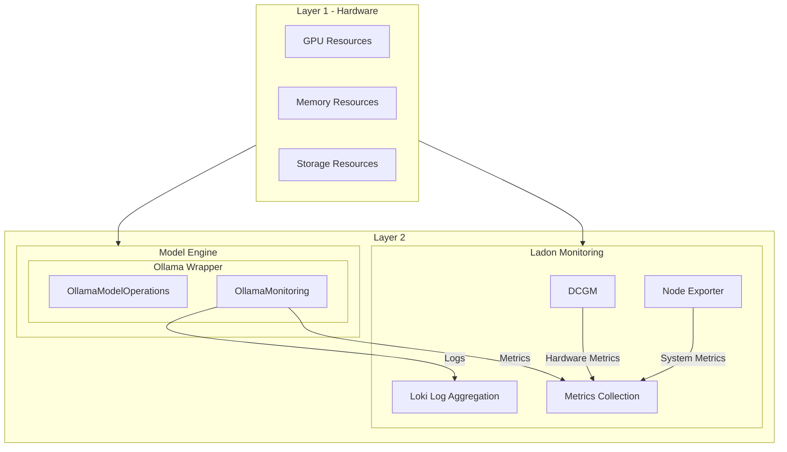
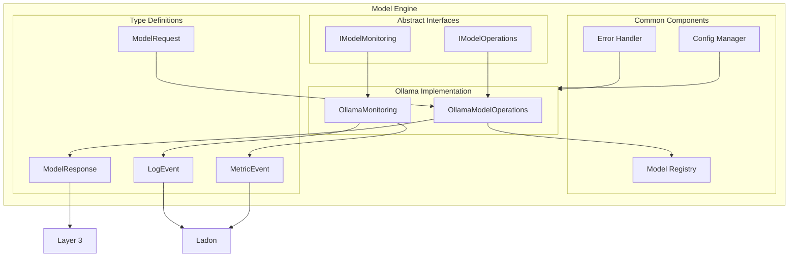

# HADES Model Engine Build Document

## Overview

The Model Engine is Layer 2 component of HADES, responsible for interfacing with model backends (starting with Ollama) and providing a clean, abstract interface for model operations. This document outlines the architecture, setup, and implementation details.

## System Requirements

- Python 3.11+
- Virtual Environment (venv)
- Ollama
- Linux OS (tested on Ubuntu 22.04)

## Layer 1 and 2 Architecture

This diagram shows how the Model Engine fits into Layer 2 and interacts with Layer 1:



## Model Engine Internal Architecture

The Model Engine is designed with modularity in mind, allowing for easy addition of new model backends:



## Installation and Setup

### 1. Python Environment Setup

```bash
# Create virtual environment
python3.11 -m venv venv

# Activate virtual environment
source venv/bin/activate

# Install dependencies
pip install -r requirements.txt
```

### 2. Ollama Installation

```bash
# Install Ollama
curl https://ollama.ai/install.sh | sh

# Start Ollama service
systemctl --user start ollama

# Enable Ollama service
systemctl --user enable ollama

# Verify installation
ollama --version
```

## Project Structure

```text
model_engine/
├── __init__.py
├── types/
│   ├── __init__.py
│   ├── model_request.py
│   ├── model_response.py
│   └── events.py
├── interfaces/
│   ├── __init__.py
│   ├── model_operations.py
│   └── model_monitoring_interface.py
├── utils/
│   ├── __init__.py
│   ├── config_manager.py
│   ├── error_handler.py
│   └── model_registry.py
└── drivers/
    ├── __init__.py
    └── ollama/
        ├── __init__.py
        ├── operations.py
        └── ollama_monitoring.py
```

## Module Implementations

### 1. Types Module

#### model_request.py

```python
from dataclasses import dataclass
from typing import Dict, Any

@dataclass
class ModelRequest:
    """Standard request format for all model operations."""
    model_name: str
    prompt: str
    parameters: Dict[str, Any]
```

#### model_response.py

```python
from dataclasses import dataclass
from typing import Dict, Any

@dataclass
class ModelResponse:
    """Standard response format for all model operations."""
    content: str
    metadata: Dict[str, Any]
```

#### events.py

```python
from dataclasses import dataclass
from typing import Dict, Any

@dataclass
class MetricEvent:
    """Standard format for metrics."""
    name: str
    value: float
    labels: Dict[str, str]
    timestamp: float

@dataclass
class LogEvent:
    """Standard format for logs."""
    level: str
    message: str
    metadata: Dict[str, Any]
    timestamp: float
```

### 2. Interfaces Module

#### model_operations.py

```python
from abc import ABC, abstractmethod
from typing import List
from ..types.model_request import ModelRequest
from ..types.model_response import ModelResponse

class IModelOperations(ABC):
    """Abstract interface for model operations."""
    
    @abstractmethod
    async def load_model(self, model_name: str) -> bool:
        """Load a model."""
        pass
    
    @abstractmethod
    async def unload_model(self, model_name: str) -> bool:
        """Unload a model."""
        pass
    
    @abstractmethod
    async def run_inference(self, request: ModelRequest) -> ModelResponse:
        """Run inference."""
        pass
    
    @abstractmethod
    async def generate_embedding(self, text: str) -> List[float]:
        """Generate embeddings."""
        pass
```

#### model_monitoring_interface.py

```python
from abc import ABC, abstractmethod
from ..types.events import MetricEvent, LogEvent

class IModelMonitoring(ABC):
    """Abstract interface for model monitoring."""
    
    @abstractmethod
    async def record_metric(self, event: MetricEvent):
        """Record a metric."""
        pass
    
    @abstractmethod
    async def log_event(self, event: LogEvent):
        """Log an event."""
        pass
```

### 3. Utils Module

#### config_manager.py

```python
from typing import Dict, Any
import yaml

class ConfigManager:
    """Manages configuration for model engine."""
    
    def __init__(self, config_path: str):
        self.config_path = config_path
        self.config = self._load_config()
    
    def _load_config(self) -> Dict[str, Any]:
        """Load configuration from YAML file."""
        with open(self.config_path, 'r') as f:
            return yaml.safe_load(f)
```

#### error_handler.py

```python
from typing import Dict, Any
from ..types.events import LogEvent

class ErrorHandler:
    """Centralized error handling."""
    
    def __init__(self, monitoring):
        self.monitoring = monitoring
    
    async def handle_error(self, error: Exception, context: Dict[str, Any]):
        """Handle an error and log it."""
        event = LogEvent(
            level="ERROR",
            message=str(error),
            metadata=context,
            timestamp=time.time()
        )
        await self.monitoring.log_event(event)
```

#### model_registry.py

```python
from typing import Dict, Set
import asyncio

class ModelRegistry:
    """Tracks loaded models and their states."""
    
    def __init__(self):
        self.loaded_models: Set[str] = set()
        self._lock = asyncio.Lock()
    
    async def register_model(self, model_name: str):
        """Register a model as loaded."""
        async with self._lock:
            self.loaded_models.add(model_name)
```

### 4. Drivers Module (Ollama Implementation)

#### operations.py

```python
from ...interfaces.model_operations import IModelOperations
from ...types.model_request import ModelRequest
from ...types.model_response import ModelResponse

class OllamaModelOperations(IModelOperations):
    """Concrete implementation for Ollama."""
    
    def __init__(self, config, monitoring, registry):
        self.config = config
        self.monitoring = monitoring
        self.registry = registry
        # Initialize Ollama client
    
    async def load_model(self, model_name: str) -> bool:
        """Load a model in Ollama."""
        try:
            # Ollama model pull implementation
            await self.registry.register_model(model_name)
            return True
        except Exception as e:
            await self.error_handler.handle_error(e, {"model": model_name})
            return False
```

#### ollama_monitoring.py

```python
from ...interfaces.model_monitoring_interface import IModelMonitoring
from ...types.events import MetricEvent, LogEvent

class OllamaMonitoring(IModelMonitoring):
    """Concrete implementation for Ollama monitoring."""
    
    def __init__(self, ladon_client):
        self.ladon = ladon_client
    
    async def record_metric(self, event: MetricEvent):
        """Send metric to Ladon."""
        await self.ladon.send_metric(event)
    
    async def log_event(self, event: LogEvent):
        """Send log to Ladon's Loki."""
        await self.ladon.send_log(event)
```

## Configuration

Example `config.yml`:

```yaml
model_engine:
  ollama:
    endpoint: "http://localhost:11434"
    default_model: "llama2"
    timeout: 30
    max_tokens: 2048
  monitoring:
    ladon_metrics_endpoint: "http://localhost:9090"
    ladon_logs_endpoint: "http://localhost:3100"
```

## Usage Example

```python
from model_engine.drivers.ollama.operations import OllamaModelOperations
from model_engine.drivers.ollama.ollama_monitoring import OllamaMonitoring
from model_engine.utils.config_manager import ConfigManager
from model_engine.types.model_request import ModelRequest

async def main():
    # Initialize components
    config = ConfigManager("config.yml")
    monitoring = OllamaMonitoring(ladon_client)
    operations = OllamaModelOperations(config, monitoring)
    
    # Create request
    request = ModelRequest(
        model_name="llama2",
        prompt="Hello, world!",
        parameters={"temperature": 0.7}
    )
    
    # Run inference
    response = await operations.run_inference(request)
    print(response.content)

if __name__ == "__main__":
    asyncio.run(main())
