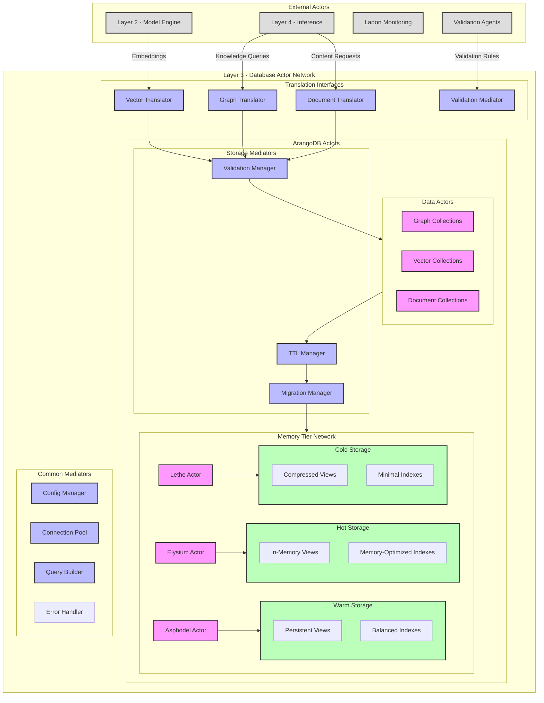
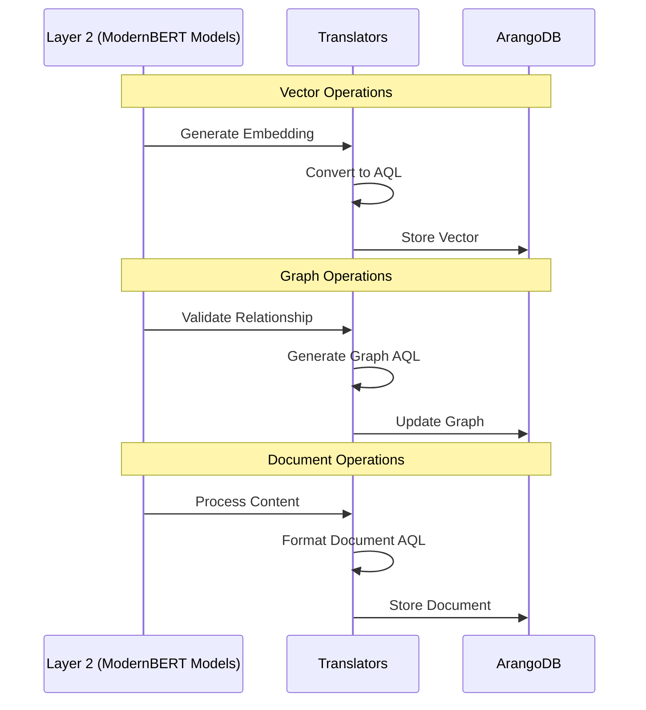
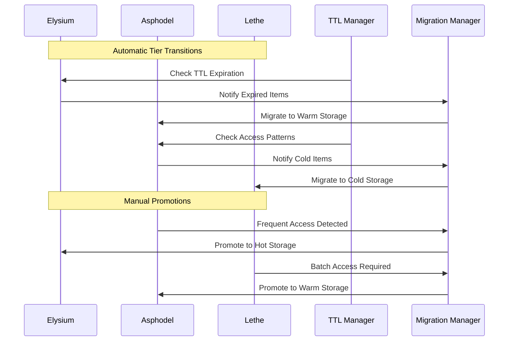
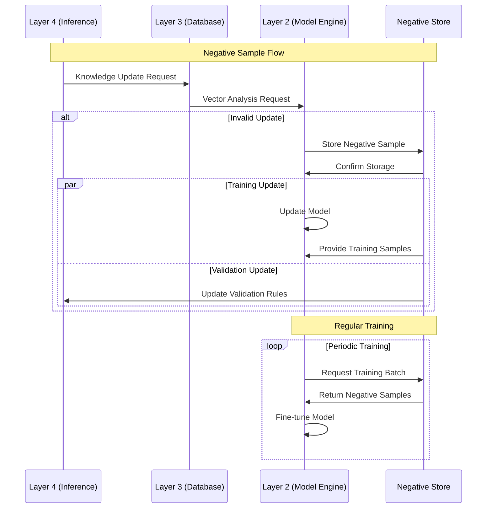
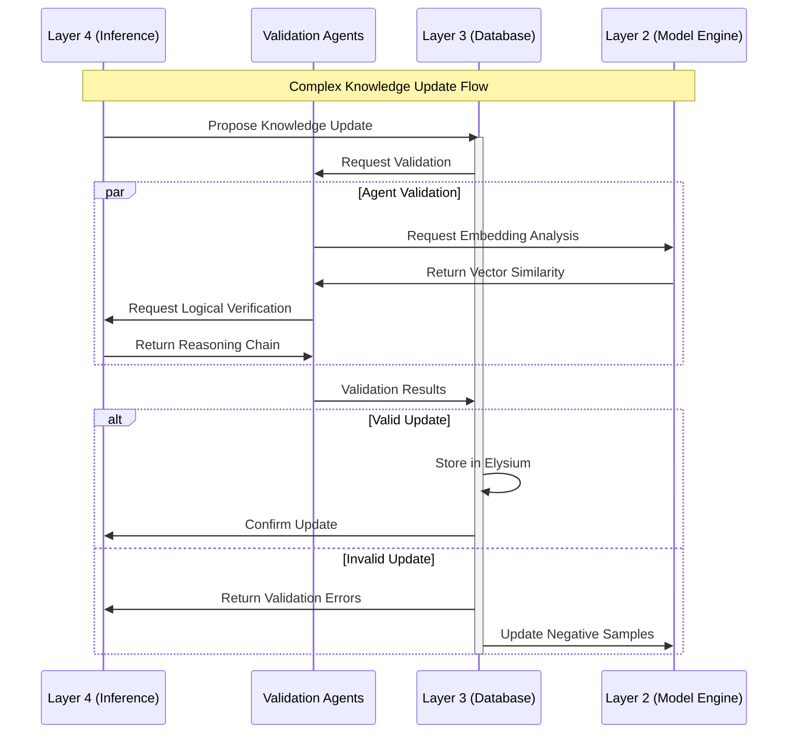

# Layer 3: Database Layer

## Architecture Overview

Layer 3 has been decoupled into three distinct components to improve modularity and maintainability:

1. **StorageManager**: Handles pure storage operations with ArangoDB
   - Graph store operations
   - Vector store operations
   - Document store operations
   - Connection pool management

2. **ValidationMediator** (Moved to Layer 4):
   - Validation rule enforcement
   - Trust score management
   - Transaction management
   - Rollback handling

3. **TranslationLayer**: Converts between formats
   - ML model output translation
   - Embedding conversion
   - Query building
   - Graph/Vector/Document translation

### Directory Structure

```text
database_layer/
├── storage/
│   ├── graph_store.py
│   ├── vector_store.py
│   ├── document_store.py
│   ├── connection_pool.py
├── translation/
│   ├── graph_translator.py
│   ├── vector_translator.py
│   ├── document_translator.py
│   ├── embedding_converter.py
│   └── query_builder.py
```

### Storage Optimization Strategy

Instead of implementing manual memory tier transitions, Layer 3 now leverages ArangoDB's built-in optimization features:

1. **Storage Configuration**
   - Graph & Vector stores → RAID0 for maximum speed
   - Document store → RAID1 for redundancy
   - Temporary cache → tmpfs (RAM-based)

2. **ArangoDB Features Utilized**
   - Built-in LRU caching
   - RocksDB compression
   - Write-Ahead Logging (WAL)
   - arangosearch view optimizations

3. **Mount Configuration**

```bash
# Storage paths
/var/lib/arangodb3/graph_vector  # RAID0
/var/lib/arangodb3/document      # RAID1
/var/lib/arangodb3/cache         # tmpfs
```

# HADES Database Layer (Layer 3) Build Document

## Overview

Layer 3 of HADES implements the database operations using ArangoDB, providing:

- Graph database for knowledge relationships
- Vector storage for embeddings
- Document storage for metadata and content
- Support for the three-tier memory system (Elysium, Asphodel, Lethe)

## System Requirements

- ArangoDB 3.12+
- Python 3.11+
- Python-arango driver
- Linux OS (tested on Ubuntu 22.04)

## Architecture

Layer 3 acts as a dynamic actor in HADES's network, actively participating in knowledge transformation and validation. It's not merely a passive storage system but an active mediator between different forms of knowledge representation.



## Translation Layer Architecture

The Translation Layer serves as an adapter between Layer 2's ModernBERT models and ArangoDB storage. Important: Translators do NOT generate embeddings - they convert embeddings and other model outputs from Layer 2 into appropriate database operations.

### Translator Roles



### Translator Implementation

1. **Vector Translator**

    ```python
    class VectorTranslator:
        """Converts Layer 2 embeddings into vector storage operations.
        NOTE: Does NOT generate embeddings - that's Layer 2's job."""
        
        async def store_embedding(self, embedding_data: dict):
            """Convert Layer 2 embedding into AQL storage operation."""
            aql = """
            INSERT {
                _key: @key,
                embedding: @vector,
                metadata: @metadata,
                model_source: @source,
                timestamp: DATE_NOW()
            } INTO vector_collection
            """
            return await self.db.execute(aql, bind_vars={
                'key': embedding_data['id'],
                'vector': embedding_data['embedding'],
                'metadata': embedding_data['metadata'],
                'source': 'modernbert_primary'
            })

        async def retrieve_similar(self, query_vector: list, k: int):
            """Convert similarity search into AQL query."""
            aql = """
            FOR doc IN vector_collection
                SEARCH ANALYZER(
                    KNN(@query, doc.embedding, @k),
                    'vector_analyzer'
                )
                SORT KNN_DISTANCE() ASC
                LIMIT @k
                RETURN doc
            """
            return await self.db.execute(aql, bind_vars={
                'query': query_vector,
                'k': k
            })
    ```

2. **Graph Translator**

    ```python
    class GraphTranslator:
        """Converts Layer 2 relationship validations into graph operations.
        NOTE: Does NOT validate relationships - that's Layer 2's job."""
        
        async def store_relationship(self, relationship_data: dict):
            """Convert Layer 2 relationship into graph edge."""
            aql = """
            INSERT {
                _from: @from,
                _to: @to,
                type: @rel_type,
                confidence: @confidence,
                validated_by: @model,
                timestamp: DATE_NOW()
            } INTO graph_edges
            """
            return await self.db.execute(aql, bind_vars={
                'from': relationship_data['source'],
                'to': relationship_data['target'],
                'rel_type': relationship_data['type'],
                'confidence': relationship_data['confidence'],
                'model': 'modernbert_context'
            })

        async def get_connected(self, node_id: str, relationship_type: str):
            """Convert relationship query into graph traversal."""
            aql = """
            FOR v, e IN 1..1 OUTBOUND @start
                GRAPH 'knowledge_graph'
                FILTER e.type == @rel_type
                RETURN {
                    node: v,
                    edge: e
                }
            """
            return await self.db.execute(aql, bind_vars={
                'start': node_id,
                'rel_type': relationship_type
            })
    ```

3. **Document Translator**

    ```python
    class DocumentTranslator:
        """Converts Layer 2 processed content into document storage.
        NOTE: Does NOT process content - that's Layer 2's job."""
        
        async def store_document(self, doc_data: dict):
            """Convert Layer 2 document into storage operation."""
            aql = """
            INSERT {
                _key: @key,
                content: @content,
                processed_by: @model,
                metadata: @metadata,
                timestamp: DATE_NOW()
            } INTO documents
            """
            return await self.db.execute(aql, bind_vars={
                'key': doc_data['id'],
                'content': doc_data['content'],
                'metadata': doc_data['metadata'],
                'model': 'modernbert_validation'
            })
    ```

### Translation Flow Examples

1. **Storing New Knowledge**

    ```mermaid
    sequenceDiagram
        participant L2 as Layer 2
        participant VT as VectorTranslator
        participant GT as GraphTranslator
        participant DT as DocumentTranslator
        participant DB as ArangoDB

        L2->>VT: Send Embedding
        VT->>VT: Generate AQL
        VT->>DB: Store Vector

        L2->>GT: Send Relations
        GT->>GT: Generate AQL
        GT->>DB: Store Edges

        L2->>DT: Send Content
        DT->>DT: Generate AQL
        DT->>DB: Store Document
    ```

2. **Querying Knowledge**

    ```mermaid
    sequenceDiagram
        participant L2 as Layer 2
        participant VT as VectorTranslator
        participant GT as GraphTranslator
        participant DB as ArangoDB

        L2->>VT: Query Vector
        VT->>VT: Generate AQL
        VT->>DB: Find Similar
        DB->>VT: Return Matches
        VT->>L2: Return Results

        L2->>GT: Query Relations
        GT->>GT: Generate AQL
        GT->>DB: Traverse Graph
        DB->>GT: Return Paths
        GT->>L2: Return Results
    ```

### Key Points

1. **Clear Separation of Concerns**
   - Layer 2 (ModernBERT): Generates embeddings, validates relationships
   - Translators: Convert model outputs to database operations
   - ArangoDB: Stores and retrieves data

2. **Translator Responsibilities**
   - Convert model outputs to AQL
   - Handle database-specific optimizations
   - Manage data consistency
   - Track operations

3. **Benefits**
   - Clean separation between ML and storage
   - Easier to modify database operations
   - Better testing isolation
   - Clear performance optimization points

## AQL Implementation

### Query Architecture

HADES uses AQL (ArangoDB Query Language) to unify operations across graph, vector, and document stores. This provides several key advantages:

1. **Unified Multi-Modal Queries**
   - Single query interface for graph traversal, vector similarity, and document retrieval
   - Reduced complexity in cross-store operations
   - Improved performance through query optimization

2. **Memory Tier Integration**

    ```aql
    LET hotStorage = (
        FOR doc IN elysium
            FILTER doc.access_count >= @hotThreshold
            RETURN doc
    )

    LET warmStorage = (
        FOR doc IN asphodel
            FILTER doc.last_access >= @warmThreshold
            RETURN doc
    )
    ```

3. **Trust-Scored Knowledge Updates**

    ```aql
    FOR vertex IN knowledge_graph
        FILTER vertex.trust_score > @trustThreshold
        LET storage_tier = (
            CASE
                WHEN vertex.access_count >= @hotThreshold THEN 'elysium'
                WHEN vertex.last_access >= @warmThreshold THEN 'asphodel'
                ELSE 'lethe'
            END
        )
        UPDATE vertex WITH { 
            storage_tier: storage_tier,
            validated: true 
        } IN knowledge_graph
    ```

### Performance Optimizations

1. **Vector Search Integration**

    ```aql
    FOR doc IN vector_collection
        SEARCH ANALYZER(
            KNN(
                doc.embedding,
                @queryVector,
                @k,
                'vector_index'
            ),
            'vector_analyzer'
        )
        SORT KNN_DISTANCE() ASC
        LIMIT @k
        RETURN {
            document: doc,
            distance: KNN_DISTANCE()
        }
    ```

2. **Graph Traversal with Trust Validation**

    ```aql
    FOR vertex, edge, path
        IN 1..3 OUTBOUND @startVertex
        GRAPH 'knowledge_graph'
        FILTER vertex.trust_score >= @minTrust
        COLLECT level = LENGTH(path.vertices) INTO vertices = vertex
        RETURN {
            level: level,
            nodes: vertices
        }
    ```

### Error Handling and Validation

1. **Transaction Management**

    ```aql
    FOR doc IN @documents
        INSERT doc INTO temp_collection
        LET validation = (
            FOR v IN temp_collection
                FILTER v._key == doc._key
                LET is_valid = v.trust_score >= @threshold
                RETURN is_valid
        )
        FILTER validation[0] == true
        INSERT doc INTO target_collection
        REMOVE doc IN temp_collection
    ```

2. **Rollback Mechanisms**

    ```aql
    LET backup = (
        FOR doc IN target_collection
            FILTER doc._key IN @keys
            RETURN doc
    )
    INSERT backup INTO backup_collection
    REMOVE { _key: @keys } IN target_collection
    ```

## Installation and Setup

### 1. ArangoDB Installation

```bash
# Import ArangoDB GPG key
curl -OL https://download.arangodb.com/arangodb312/DEBIAN/Release.key
sudo apt-key add - < Release.key

# Add repository
echo 'deb https://download.arangodb.com/arangodb312/DEBIAN/ /' | sudo tee /etc/apt/sources.list.d/arangodb.list
sudo apt-get update

# Install ArangoDB
sudo apt-get install arangodb3=3.12.0

# Start and enable service
sudo systemctl start arangodb3
sudo systemctl enable arangodb3

# Verify installation
arangodb --version
```

### 2. Python Environment Setup

```bash
# Install Python driver
pip install python-arango

# Install additional dependencies
pip install pydantic python-dotenv
```

## Project Structure

```text
database_layer/
├── __init__.py
├── types/
│   ├── __init__.py
│   ├── node.py
│   ├── edge.py
│   ├── vector.py
│   └── document.py
├── interfaces/
│   ├── __init__.py
│   ├── graph_operations.py
│   ├── vector_operations.py
│   └── document_operations.py
├── utils/
│   ├── __init__.py
│   ├── config_manager.py
│   ├── connection_pool.py
│   └── query_builder.py
└── arango/
    ├── __init__.py
    ├── graph_store.py
    ├── vector_store.py
    └── document_store.py
```

## Module Implementations

### 1. Types Module

#### node.py

```python
from typing import Dict, Any, List
from pydantic import BaseModel, Field

class Node(BaseModel):
    """Base class for all nodes in the knowledge graph."""
    key: str = Field(..., description="Unique identifier")
    label: str = Field(..., description="Node type/label")
    properties: Dict[str, Any] = Field(default_factory=dict)
    embedding: List[float] = Field(default_factory=list)
    memory_tier: str = Field(default="asphodel")
    
    class Config:
        frozen = True
```

#### edge.py

```python
from typing import Dict, Any
from pydantic import BaseModel, Field

class Edge(BaseModel):
    """Base class for relationships between nodes."""
    from_node: str = Field(..., description="Source node key")
    to_node: str = Field(..., description="Target node key")
    label: str = Field(..., description="Edge type/label")
    properties: Dict[str, Any] = Field(default_factory=dict)
    weight: float = Field(default=1.0)
    
    class Config:
        frozen = True
```

### 2. Interfaces Module

#### graph_operations.py

```python
from typing import List, Optional
from ..types.node import Node
from ..types.edge import Edge

async def create_node(node: Node) -> bool:
    """Create a new node in the graph."""
    
async def create_edge(edge: Edge) -> bool:
    """Create a new edge between nodes."""
    
async def get_neighbors(
    node_key: str,
    edge_label: Optional[str] = None,
    direction: str = "outbound"
) -> List[Node]:
    """Get neighboring nodes."""
    
async def shortest_path(
    from_key: str,
    to_key: str,
    max_depth: int = 3
) -> List[Edge]:
    """Find shortest path between nodes."""
```

#### vector_operations.py

```python
from typing import List, Dict
import numpy as np

async def store_embedding(
    key: str,
    embedding: List[float],
    metadata: Dict[str, any]
) -> bool:
    """Store a vector embedding."""
    
async def search_similar(
    embedding: List[float],
    limit: int = 10,
    threshold: float = 0.8
) -> List[Dict[str, any]]:
    """Find similar vectors."""
```

### 3. Utils Module

#### connection_pool.py

```python
from typing import Dict
from arango import ArangoClient
import asyncio

class ConnectionPool:
    """Manages ArangoDB connections."""
    
    def __init__(self, config: Dict[str, any]):
        self.config = config
        self.pool = {}
        self._lock = asyncio.Lock()
    
    async def get_connection(self, database: str = "_system"):
        """Get a connection from the pool."""
        async with self._lock:
            if database not in self.pool:
                client = ArangoClient(
                    hosts=self.config["hosts"],
                    http_client=self.config.get("http_client")
                )
                self.pool[database] = client.db(
                    database,
                    username=self.config["username"],
                    password=self.config["password"]
                )
            return self.pool[database]
```

### 4. ArangoDB Implementation

#### graph_store.py

```python
from typing import List, Optional
from ...interfaces.graph_operations import *
from ...types.node import Node
from ...types.edge import Edge

class ArangoGraphStore:
    """ArangoDB implementation of graph operations."""
    
    def __init__(self, connection_pool, config):
        self.pool = connection_pool
        self.config = config
    
    async def create_node(self, node: Node) -> bool:
        """Create node in ArangoDB."""
        conn = await self.pool.get_connection()
        collection = conn.collection(node.label)
        try:
            result = await collection.insert(node.dict())
            return True
        except Exception as e:
            # Log error
            return False
    
    async def get_neighbors(
        self,
        node_key: str,
        edge_label: Optional[str] = None,
        direction: str = "outbound"
    ) -> List[Node]:
        """Get neighboring nodes using AQL."""
        conn = await self.pool.get_connection()
        
        # Build AQL query
        aql = """
        FOR v, e IN 1..1 OUTBOUND @start_vertex @@edge_collection
        RETURN v
        """
        
        bind_vars = {
            "start_vertex": node_key,
            "@edge_collection": edge_label or "edges"
        }
        
        try:
            cursor = await conn.aql.execute(aql, bind_vars=bind_vars)
            return [Node(**doc) for doc in cursor]
        except Exception as e:
            # Log error
            return []
```

## Model Updates and Data Integration

### Combined Vector and Graph Updates

The ModernBERT models in Layer 2 update both vector embeddings and graph relationships. Here's how:

1. **Simultaneous Update Example**

    ```aql
    // Step 1: Update vector embedding
    LET vector_update = (
        UPDATE @docId WITH {
            embedding: @newEmbedding,
            last_updated: DATE_NOW(),
            update_source: 'modernbert_primary'
        } IN vector_collection
        RETURN NEW
    )

    // Step 2: Update graph relationships based on semantic similarity
    LET similar_nodes = (
        FOR doc IN vector_collection
            SEARCH ANALYZER(
                KNN(
                    doc.embedding,
                    @newEmbedding,
                    5,
                    'vector_index'
                ),
                'vector_analyzer'
            )
            RETURN doc._id
    )

    // Step 3: Create or update graph edges
    FOR node_id IN similar_nodes
        UPSERT { _from: @docId, _to: node_id }
        INSERT { 
            _from: @docId, 
            _to: node_id,
            relationship_type: 'semantic_similarity',
            confidence: KNN_DISTANCE(),
            trust_score: @initialTrust
        }
        UPDATE {
            confidence: KNN_DISTANCE(),
            trust_score: AVERAGE([OLD.trust_score, @newTrust])
        } IN graph_edges
    ```

2. **Validation and Rollback**

    ```aql
    // Transaction to ensure consistency
    LET validation_result = (
        FOR v IN validation_collection
            FILTER v.doc_id == @docId
            COLLECT AGGREGATE 
                is_valid = MIN(v.trust_score >= @minTrust)
            RETURN is_valid
    )

    RETURN LENGTH(validation_result) == 0 || validation_result[0] == true
        ? (RETURN { status: 'success', updates: vector_update })
        : (RETURN { status: 'failed', reason: 'validation_failed' })
    ```

### Negative Sampling Implementation

HADES implements negative sampling for both vector and graph data to improve model accuracy:

1. **Vector Negative Sampling**

    ```aql
    // Find challenging negative examples for vector training
    LET positive_example = DOCUMENT(vector_collection, @docId)

    // Get semantically close but different concepts
    LET hard_negatives = (
        FOR doc IN vector_collection
            SEARCH ANALYZER(
                KNN(
                    doc.embedding,
                    positive_example.embedding,
                    10,
                    'vector_index'
                ),
                'vector_analyzer'
            )
            FILTER doc.category != positive_example.category
            SORT KNN_DISTANCE() ASC
            LIMIT 5
            RETURN {
                vector: doc.embedding,
                distance: KNN_DISTANCE(),
                category: doc.category
            }
    )

    // Get random distant examples
    LET random_negatives = (
        FOR doc IN vector_collection
            FILTER doc.category != positive_example.category
            SORT RAND()
            LIMIT 5
            RETURN {
                vector: doc.embedding,
                category: doc.category
            }
    )

    RETURN {
        positive: positive_example,
        hard_negatives: hard_negatives,
        random_negatives: random_negatives
    }
    ```

2. **Graph Negative Sampling**

```aql
// Find challenging negative relationships
LET existing_edges = (
    FOR v, e IN 1..2 OUTBOUND @docId graph_collection
        RETURN {
            node: v._id,
            relationship: e.relationship_type
        }
)

// Find nodes that could be but aren't connected
LET potential_false_positives = (
    FOR doc IN vector_collection
        SEARCH ANALYZER(
            KNN(
                doc.embedding,
                DOCUMENT(vector_collection, @docId).embedding,
                20,
                'vector_index'
            ),
            'vector_analyzer'
        )
        FILTER doc._id NOT IN existing_edges[*].node
        SORT KNN_DISTANCE() ASC
        LIMIT 10
        RETURN {
            node: doc,
            similarity: KNN_DISTANCE()
        }
)

RETURN {
    true_relationships: existing_edges,
    negative_samples: potential_false_positives
}
```

### Trust Score Management

Trust scores affect both vector and graph operations and evolve over time:

1. **Trust Score Updates**

    ```aql
    // Update trust scores based on validation results
    LET validation_results = (
        FOR v IN validation_collection
            FILTER v.doc_id == @docId
            RETURN v.validation_score
    )

    LET new_trust_score = (
        LENGTH(validation_results) == 0 
        ? @initialTrust 
        : AVERAGE(validation_results)
    )

    // Update vector trust
    UPDATE @docId WITH {
        trust_score: new_trust_score,
        trust_updates: APPEND(
            OLD.trust_updates || [], 
            {
                score: new_trust_score,
                timestamp: DATE_NOW(),
                source: @validationSource
            }
        )
    } IN vector_collection

    // Propagate trust to graph
    FOR v, e IN 1..1 OUTBOUND @docId graph_collection
        UPDATE e WITH {
            trust_score: AVERAGE([
                DOCUMENT(vector_collection, e._from).trust_score,
                DOCUMENT(vector_collection, e._to).trust_score
            ])
        } IN graph_edges
    ```

2. **Trust-Based Operations**

    ```aql
    // Example: Trust affects both vector search and graph traversal
    LET trusted_vectors = (
        FOR doc IN vector_collection
            SEARCH ANALYZER(
                KNN(
                    doc.embedding,
                    @queryVector,
                    @k,
                    'vector_index'
                ),
                'vector_analyzer'
            )
            FILTER doc.trust_score >= @minTrust
            SORT KNN_DISTANCE() ASC
            LIMIT @k
            RETURN doc
    )

    FOR doc IN trusted_vectors
        FOR v, e, p IN 1..3 OUTBOUND doc graph_collection
            FILTER ALL(
                x IN p.edges[*] // Check all edges in path
                RETURN x.trust_score >= @minTrust
            )
            RETURN {
                start: doc,
                path: p,
                final: v,
                aggregate_trust: AVERAGE(p.edges[*].trust_score)
            }
    ```

3. **Trust Score Evolution**

```aql
// Track trust score changes over time
FOR doc IN vector_collection
    FILTER doc._key == @docId
    LET trust_history = (
        FOR update IN doc.trust_updates
        SORT update.timestamp DESC
        RETURN update
    )
    LET trust_trend = (
        LENGTH(trust_history) >= 2
        ? (LAST(trust_history).score - FIRST(trust_history).score)
        : 0
    )
    UPDATE doc WITH {
        trust_trend: trust_trend,
        trust_velocity: trust_trend / (
            LENGTH(trust_history) >= 2
            ? DATE_DIFF(
                FIRST(trust_history).timestamp,
                LAST(trust_history).timestamp,
                "d"
            )
            : 1
        )
    } IN vector_collection
```

These implementations ensure that:

1. Vector and graph updates remain consistent
2. Negative sampling improves model accuracy
3. Trust scores evolve based on validation
4. Operations respect trust thresholds
5. Changes are tracked and can be rolled back

## Memory Tier Implementation

The memory tier system is implemented as a network of active storage actors, each with specific responsibilities and behaviors:

### 1. Elysium (Hot Storage)

```yaml
Implementation:
  - ArangoDB In-Memory Views
  - Memory-Optimized RocksDB Indexes
  - Write-Ahead Log (WAL) for durability

Characteristics:
  - Fully memory-resident
  - Sub-millisecond access times
  - Limited by available RAM
  - Automatic eviction based on LRU

Configuration:
  max_size_gb: 2
  ttl_hours: 24
  index_type: "memory-optimized"
  compression: false
```

### 2. Asphodel (Warm Storage)

```yaml
Implementation:
  - Persistent ArangoDB Collections
  - Balanced RocksDB Indexes
  - Selective In-Memory Caching

Characteristics:
  - Disk-based with memory caching
  - Millisecond access times
  - Balance between performance and capacity
  - Automatic promotion/demotion

Configuration:
  max_size_gb: 10
  cache_percentage: 30
  index_type: "persistent"
  compression: "snappy"
```

### 3. Lethe (Cold Storage)

```yaml
Implementation:
  - Compressed ArangoDB Collections
  - Minimal Indexes
  - Bulk Access Optimized

Characteristics:
  - Heavily compressed
  - Second-range access times
  - Optimized for storage efficiency
  - Batch processing friendly

Configuration:
  compression: true
  compression_level: 3
  max_chunk_size_mb: 64         # Maximum chunk size for compression
  batch_size: 1000               # Batch size for operations
```

### Memory Tier Transitions



### Implementation Details

1. **TTL Manager**

    ```python
    async def check_expirations(self):
        """Check for expired items in Elysium."""
        aql = """
        FOR doc IN @@collection
        FILTER doc.memory_tier == 'elysium'
            AND doc.last_access < DATE_SUBTRACT(
                DATE_NOW(), "hour", @ttl
            )
        RETURN doc
        """
        # Implementation
    ```

2. **Migration Manager**

    ```python
    async def migrate_tier(self, doc_id: str, from_tier: str, to_tier: str):
        """Migrate document between memory tiers."""
        async with self.transaction() as txn:
            # 1. Copy document to new tier
            # 2. Update indexes
            # 3. Remove from old tier
            # 4. Commit or rollback
            # Implementation
    ```

3. **Access Tracking**

    ```python
    async def track_access(self, doc_id: str):
        """Track document access patterns."""
        # Hourly counter
        hourly_key = f"access:hourly:{doc_id}"
        await self.redis.incr(hourly_key)
        await self.redis.expire(hourly_key, 3600)  # 1 hour window
        
        # Daily counter
        daily_key = f"access:daily:{doc_id}"
        await self.redis.incr(daily_key)
        await self.redis.expire(daily_key, 86400)  # 1 day
        
        # Last access timestamp
        await self.redis.set(
            f"access:last:{doc_id}",
            time.time()
        )
        
    async def check_promotion_candidate(
        self,
        doc_id: str
    ) -> bool:
        """Check if document should be promoted to Elysium."""
        hourly_count = int(
            await self.redis.get(f"access:hourly:{doc_id}") or 0
        )
        return hourly_count >= self.promotion_threshold
        
    async def check_demotion_candidate(
        self,
        doc_id: str
    ) -> bool:
        """Check if document should be demoted to Lethe."""
        last_access = float(
            await self.redis.get(f"access:last:{doc_id}") or 0
        )
        days_inactive = (time.time() - last_access) / 86400
        return days_inactive >= self.demotion_threshold

    ```

### Dynamic Recursion Control

```python
class KnowledgeTraversal:
    """Manages dynamic, trust-based knowledge traversal."""
    
    def __init__(self, base_threshold: float = 0.85):
        self.base_threshold = base_threshold
        self.max_depth = 10
        self.timeout_ms = 5000  # 5 second timeout
    
    async def calculate_max_depth(self, start_node: str) -> int:
        """Dynamically calculate max depth based on node connectivity."""
        aql = """
        LET node_stats = (
            FOR v, e, p IN 1..10 OUTBOUND @start_node GRAPH 'knowledge_graph'
                COLLECT depth = LENGTH(p.vertices)
                AGGREGATE 
                    avg_trust = AVG(v.trust_score),
                    count = COUNT(v)
                RETURN {
                    depth: depth,
                    avg_trust: avg_trust,
                    count: count
                }
        )
        
        // Find optimal depth where trust and connectivity balance
        RETURN FIRST(
            FOR stat IN node_stats
                FILTER stat.avg_trust >= @base_threshold
                    AND stat.count >= 5
                SORT stat.depth DESC
                LIMIT 1
                RETURN stat.depth
        )
        """
        result = await self.db.execute(aql, {
            'start_node': start_node,
            'base_threshold': self.base_threshold
        })
        return result or self.max_depth

    async def traverse_with_timeout(self, start_node: str) -> Dict:
        """Traverse graph with dynamic depth and timeout."""
        max_depth = await self.calculate_max_depth(start_node)
        
        aql = """
        WITH knowledge_graph_collection
        
        LET start_time = DATE_NOW()
        LET timeout = @timeout_ms
        
        FOR vertex, edge, path IN 1..@max_depth 
            OUTBOUND @start_node 
            GRAPH 'knowledge_graph'
            
            // Check timeout
            FILTER DATE_DIFF(
                start_time,
                DATE_NOW(),
                'ms'
            ) < timeout
            
            // Trust-based filtering
            FILTER vertex.trust_score > @threshold
            
            // Track traversal metadata
            INSERT {
                _key: CONCAT('traversal_', vertex._key),
                node_id: vertex._key,
                depth: LENGTH(path.vertices),
                timestamp: DATE_NOW(),
                trust_at_depth: vertex.trust_score
            } INTO traversal_history
            
            UPDATE vertex WITH {
                last_accessed: DATE_NOW(),
                access_count: vertex.access_count + 1
            } IN knowledge_graph_collection
            
            RETURN {
                vertex: vertex,
                depth: LENGTH(path.vertices),
                path: path
            }
        """
        
        return await self.db.execute(aql, {
            'start_node': start_node,
            'max_depth': max_depth,
            'threshold': self.base_threshold,
            'timeout_ms': self.timeout_ms
        })
```

### Optimized Indexing Strategy

```aql
// 1. Graph Traversal Indexes
CREATE INDEX idx_graph_trust ON knowledge_graph_collection(
    trust_score,
    last_accessed,
    access_count
) OPTIONS { sparse: false }

// 2. Vector Search Index
CREATE INDEX idx_vector_embedding ON vector_collection(
    embedding
) OPTIONS { 
    type: "vector",
    dimension: 768,
    metric: "cosine",
    cache: true
}

// 3. Composite Index for Knowledge Updates
CREATE INDEX idx_knowledge_updates ON knowledge_graph_collection(
    last_updated,
    version,
    trust_score
) OPTIONS { sparse: false }

// 4. Time-based Index for Garbage Collection
CREATE INDEX idx_temporal ON knowledge_graph_collection(
    last_accessed,
    expiration_date
) OPTIONS { sparse: true }
```

### Conflict Resolution and Versioning

```python
class KnowledgeVersionManager:
    """Manages versioning and conflict resolution for knowledge updates."""
    
    async def update_with_version(
        self,
        node_id: str,
        updates: Dict[str, Any],
        source: str
    ) -> Dict:
        """Update node with versioning and conflict detection."""
        aql = """
        LET current = DOCUMENT(@node_id)
        
        LET conflicts = (
            FOR update IN update_log
                FILTER update.node_id == @node_id
                    AND update.status == 'pending'
                    AND update.timestamp > current.last_updated
                RETURN update
        )
        
        LET new_version = {
            version: current.version + 1,
            changes: @updates,
            source: @source,
            timestamp: DATE_NOW(),
            previous_version: current.version
        }
        
        // If no conflicts, apply update
        RETURN LENGTH(conflicts) == 0
            ? (
                UPDATE @node_id WITH MERGE(
                    @updates,
                    {
                        version: new_version.version,
                        update_history: APPEND(
                            current.update_history || [],
                            new_version
                        )
                    }
                ) IN knowledge_graph_collection
                RETURN { 
                    status: 'success',
                    version: new_version.version
                }
            )
            : (
                // Log conflict for Layer 5 resolution
                INSERT {
                    node_id: @node_id,
                    attempted_update: new_version,
                    conflicts: conflicts,
                    status: 'conflict',
                    timestamp: DATE_NOW()
                } INTO update_conflicts
                RETURN {
                    status: 'conflict',
                    conflicts: conflicts
                }
            )
        """
        
        return await self.db.execute(aql, {
            'node_id': node_id,
            'updates': updates,
            'source': source
        })
```

### Garbage Collection and Knowledge Cleanup

```python
class KnowledgeCleanupManager:
    """Manages cleanup of stale knowledge and maintains database health."""
    
    def __init__(self):
        self.expiration_days = 365
        self.min_trust_score = 0.3
        self.min_access_count = 5
    
    async def cleanup_stale_knowledge(self) -> Dict[str, int]:
        """Remove outdated knowledge based on access patterns and trust."""
        aql = """
        LET expiration = DATE_SUBTRACT(
            DATE_NOW(),
            @days,
            'day'
        )
        
        // 1. Find candidates for removal
        LET candidates = (
            FOR vertex IN knowledge_graph_collection
                FILTER vertex.last_accessed < expiration
                    AND vertex.trust_score < @min_trust
                    AND vertex.access_count < @min_access
                
                // Check for recent references
                LET references = (
                    FOR v, e IN 1..1 ANY vertex
                        GRAPH 'knowledge_graph'
                        FILTER e.last_accessed >= expiration
                        LIMIT 1
                        RETURN 1
                )
                
                FILTER LENGTH(references) == 0
                
                // Archive node before removal
                INSERT vertex INTO knowledge_archive
                
                RETURN vertex._key
        )
        
        // 2. Remove archived nodes
        FOR key IN candidates
            REMOVE key IN knowledge_graph_collection
            
        RETURN {
            removed: LENGTH(candidates),
            timestamp: DATE_NOW()
        }
        """
        
        return await self.db.execute(aql, {
            'days': self.expiration_days,
            'min_trust': self.min_trust_score,
            'min_access': self.min_access_count
        })
    
    async def schedule_cleanup(self, interval_hours: int = 24):
        """Schedule periodic cleanup tasks."""
        while True:
            try:
                result = await self.cleanup_stale_knowledge()
                self.logger.info(f"Cleanup completed: {result}")
            except Exception as e:
                self.logger.error(f"Cleanup failed: {e}")
            
            await asyncio.sleep(interval_hours * 3600)
```

### Integration with Layer 5

```python
class Layer5Interface:
    """Interface for Layer 5 orchestration of database operations."""
    
    async def handle_conflict(
        self,
        conflict: Dict[str, Any]
    ) -> Dict[str, Any]:
        """Forward conflicts to Layer 5 for resolution."""
        return await self.layer5_client.resolve_conflict({
            'node_id': conflict['node_id'],
            'updates': conflict['attempted_update'],
            'conflicts': conflict['conflicts'],
            'timestamp': conflict['timestamp']
        })
    
    async def notify_cleanup(
        self,
        cleanup_result: Dict[str, Any]
    ) -> None:
        """Notify Layer 5 of cleanup operations."""
        await self.layer5_client.log_cleanup(cleanup_result)
```

These implementations provide:

1. Dynamic recursion depth based on trust and connectivity
2. Comprehensive indexing strategy for all operations
3. Versioning and conflict detection with Layer 5 integration
4. Smart garbage collection with archiving
5. Proper monitoring and logging

## Database Schema

### Collections

1. Nodes (Document Collections)
   - concepts
   - entities
   - facts
   - rules

2. Edges (Edge Collections)
   - relationships
   - dependencies
   - inferences

3. Vectors (Document Collections with indexes)
   - embeddings

### Memory Tiers

Implemented using ArangoDB views and collections:

1. Elysium (Hot Storage)
   - In-memory views
   - Frequently accessed data
   - Recent additions

2. Asphodel (Warm Storage)
   - Default storage
   - Balance between performance and space

3. Lethe (Cold Storage)
   - Compressed storage
   - Rarely accessed data
   - Historical records

## Configuration

Example `config.yml`:

```yaml
database:
  arango:
    hosts: "http://localhost:8529"
    username: "root"
    password: "your_password"
    database: "hades"
    
  memory_tiers:
    elysium:
      # Access-based parameters
      min_hourly_accesses: 100        # Minimum accesses/hour for promotion
      retention_period_hours: 24      # How long to keep in Elysium
      max_size_percentage: 20         # Maximum % of total memory
      
      # Index configuration
      index_type: "memory-optimized"
      in_memory_fields: ["embedding", "metadata"]
      
    asphodel:
      # Balanced parameters
      promotion_threshold: 50         # Accesses/hour for Elysium promotion
      demotion_threshold_days: 5      # Days inactive before Lethe demotion
      cache_percentage: 30            # % of data to keep in memory
      
      # Index configuration
      index_type: "persistent"
      cached_fields: ["embedding"]
      
    lethe:
      # Archive parameters
      batch_size: 1000               # Batch size for operations
      compression_ratio: 0.4         # Target compression ratio
      max_chunk_size_mb: 64         # Maximum chunk size for compression
      
      # Retrieval configuration
      warm_up_time_seconds: 300     # Time to warm up when accessing cold data
```

## Usage Example

```python
from database_layer.arango import ArangoGraphStore
from database_layer.types.node import Node
from database_layer.utils.connection_pool import ConnectionPool

async def main():
    # Initialize components
    config = load_config("config.yml")
    pool = ConnectionPool(config["database"]["arango"])
    graph_store = ArangoGraphStore(pool, config)
    
    # Create a node
    node = Node(
        key="concept_123",
        label="concepts",
        properties={"name": "Neural Network"},
        memory_tier="elysium"
    )
    
    # Store in database
    success = await graph_store.create_node(node)
    
    # Query neighbors
    neighbors = await graph_store.get_neighbors(
        node_key="concept_123",
        edge_label="relationships"
    )
    
    print(f"Found {len(neighbors)} related concepts")

if __name__ == "__main__":
    asyncio.run(main())

## Monitoring and Observability

### 1. Metrics Collection
```python
from prometheus_client import Counter, Histogram, Gauge
import time

class DatabaseMetrics:
    """Prometheus metrics for database operations."""
    
    def __init__(self):
        # Operation counters
        self.operation_count = Counter(
            'db_operations_total',
            'Total database operations',
            ['operation_type', 'status']
        )
        
        # Latency histograms
        self.operation_latency = Histogram(
            'db_operation_duration_seconds',
            'Database operation latency',
            ['operation_type'],
            buckets=(0.1, 0.5, 1.0, 2.0, 5.0)
        )
        
        # Memory tier gauges
        self.memory_tier_size = Gauge(
            'memory_tier_size_bytes',
            'Current size of memory tier',
            ['tier']
        )
        
        # Connection pool metrics
        self.active_connections = Gauge(
            'db_active_connections',
            'Number of active database connections'
        )
        
    @contextmanager
    def track_operation(self, operation_type: str):
        """Track operation latency and status."""
        start_time = time.time()
        try:
            yield
            self.operation_count.labels(
                operation_type=operation_type,
                status="success"
            ).inc()
        except Exception as e:
            self.operation_count.labels(
                operation_type=operation_type,
                status="error"
            ).inc()
            raise e
        finally:
            self.operation_latency.labels(
                operation_type=operation_type
            ).observe(time.time() - start_time)
```

### 2. Ladon Integration

```python
from typing import Dict, Any
import json

class LadonReporter:
    """Report database events to Ladon."""
    
    def __init__(self, ladon_client):
        self.client = ladon_client
        
    async def report_operation(
        self,
        operation: str,
        data: Dict[str, Any],
        metadata: Dict[str, Any]
    ):
        """Report database operation to Ladon."""
        event = {
            "type": "database_operation",
            "operation": operation,
            "data": self._sanitize_data(data),
            "metadata": metadata,
            "timestamp": time.time()
        }
        
        await self.client.send_event(event)
    
    def _sanitize_data(self, data: Dict[str, Any]) -> Dict[str, Any]:
        """Remove sensitive information before reporting."""
        sanitized = data.copy()
        sensitive_fields = ["password", "key", "token"]
        
        for field in sensitive_fields:
            if field in sanitized:
                sanitized[field] = "[REDACTED]"
        
        return sanitized
```

## Testing Strategy

### 1. Unit Tests

```python
import pytest
from unittest.mock import AsyncMock, patch

@pytest.mark.asyncio
async def test_vector_search():
    """Test vector similarity search."""
    store = VectorStore("test_collection", dimension=768)
    
    # Mock ArangoDB response
    mock_response = [
        {"document": {"id": "1"}, "distance": 0.1},
        {"document": {"id": "2"}, "distance": 0.2}
    ]
    
    with patch('database.vector_store.db.aql.execute') as mock_execute:
        mock_execute.return_value = mock_response
        results = await store.search_similar([0.1] * 768)
        
        assert len(results) == 2
        assert results[0]["distance"] < results[1]["distance"]

@pytest.mark.asyncio
async def test_memory_tier_migration():
    """Test data migration between memory tiers."""
    migration_manager = MigrationManager()
    
    # Test document in Elysium
    doc_id = "test_doc"
    
    # Mock successful migration
    with patch('database.memory.migrate_tier') as mock_migrate:
        mock_migrate.return_value = True
        success = await migration_manager.migrate_tier(
            doc_id,
            from_tier="elysium",
            to_tier="asphodel"
        )
        
        assert success
        mock_migrate.assert_called_once_with(
            doc_id, "elysium", "asphodel"
        )
```

### 2. Integration Tests

```python
@pytest.mark.integration
async def test_full_data_lifecycle():
    """Test complete data lifecycle through memory tiers."""
    # 1. Create test data
    doc = {
        "id": "lifecycle_test",
        "content": "test data",
        "memory_tier": "elysium"
    }
    
    # 2. Store in Elysium
    await store_document(doc)
    
    # 3. Verify storage
    stored_doc = await get_document(doc["id"])
    assert stored_doc["memory_tier"] == "elysium"
    
    # 4. Wait for TTL
    await asyncio.sleep(2)  # Reduced for testing
    
    # 5. Verify migration to Asphodel
    stored_doc = await get_document(doc["id"])
    assert stored_doc["memory_tier"] == "asphodel"
```

## Deployment

### 1. Docker Compose Configuration

```yaml
version: '3.8'

services:
  coordinator1:
    image: arangodb:3.12
    environment:
      ARANGO_NO_AUTH: 0
      ARANGO_ROOT_PASSWORD: ${ARANGO_ROOT_PASSWORD}
      CLUSTER_MODE: true
      ROLE: coordinator
    ports:
      - "8529:8529"
    volumes:
      - coordinator1_data:/var/lib/arangodb3
    networks:
      - arango_network

  dbserver1:
    image: arangodb:3.12
    environment:
      ARANGO_NO_AUTH: 0
      ARANGO_ROOT_PASSWORD: ${ARANGO_ROOT_PASSWORD}
      CLUSTER_MODE: true
      ROLE: dbserver
    volumes:
      - dbserver1_data:/var/lib/arangodb3
    networks:
      - arango_network

  agent1:
    image: arangodb:3.12
    environment:
      ARANGO_NO_AUTH: 0
      ARANGO_ROOT_PASSWORD: ${ARANGO_ROOT_PASSWORD}
      CLUSTER_MODE: true
      ROLE: agent
    volumes:
      - agent1_data:/var/lib/arangodb3
    networks:
      - arango_network

networks:
  arango_network:
    driver: bridge

volumes:
  coordinator1_data:
  dbserver1_data:
  agent1_data:
```

### 2. Kubernetes Configuration

```yaml
apiVersion: apps/v1
kind: StatefulSet
metadata:
  name: arangodb-cluster
spec:
  serviceName: arangodb
  replicas: 3
  selector:
    matchLabels:
      app: arangodb
  template:
    metadata:
      labels:
        app: arangodb
    spec:
      containers:
      - name: arangodb
        image: arangodb:3.12
        ports:
        - containerPort: 8529
        env:
        - name: ARANGO_ROOT_PASSWORD
          valueFrom:
            secretKeyRef:
              name: arango-secrets
              key: root-password
        volumeMounts:
        - name: data
          mountPath: /var/lib/arangodb3
  volumeClaimTemplates:
  - metadata:
      name: data
    spec:
      accessModes: [ "ReadWriteOnce" ]
      resources:
        requests:
          storage: 10Gi
```

## Future Considerations

1. **Scaling Strategy**
   - Implement horizontal scaling with ArangoDB cluster
   - Add read replicas for heavy query loads
   - Consider sharding strategy for large datasets

2. **Performance Optimization**
   - Implement query result caching
   - Optimize index usage
   - Add query plan analysis

3. **Security Enhancements**
   - Implement row-level security
   - Add audit logging
   - Enhance encryption at rest

4. **Monitoring Improvements**
   - Add detailed query performance tracking
   - Implement automated capacity planning
   - Enhanced error analysis

5. **Data Management**
   - Implement automated backup strategy
   - Add data lifecycle management
   - Implement data retention policies

## Performance Tuning and Optimization

### 1. Memory Tier Tuning Parameters

```yaml
memory_tiers:
  elysium:
    # Access-based parameters
    min_hourly_accesses: 100        # Minimum accesses/hour for promotion
    retention_period_hours: 24      # How long to keep in Elysium
    max_size_percentage: 20         # Maximum % of total memory
    
    # Index configuration
    index_type: "memory-optimized"
    in_memory_fields: ["embedding", "metadata"]
    
  asphodel:
    # Balanced parameters
    promotion_threshold: 50         # Accesses/hour for Elysium promotion
    demotion_threshold_days: 5      # Days inactive before Lethe demotion
    cache_percentage: 30            # % of data to keep in memory
    
    # Index configuration
    index_type: "persistent"
    cached_fields: ["embedding"]
    
  lethe:
    # Archive parameters
    batch_size: 1000               # Batch size for operations
    compression_ratio: 0.4         # Target compression ratio
    max_chunk_size_mb: 64         # Maximum chunk size for compression
    
    # Retrieval configuration
    warm_up_time_seconds: 300     # Time to warm up when accessing cold data
```

### 2. Vector Operation Optimization

```python
class VectorOptimizationConfig:
    """Configuration for vector operations."""
    
    def __init__(self):
        # ArangoSearch optimization
        self.vector_index_config = {
            "type": "arangosearch",
            "properties": {
                "cleanup_interval_step": 1000,    # Clean up every N operations
                "commit_interval_msec": 1000,     # Commit changes interval
                "consolidation_interval_msec": 1000,
                "consolidation_policy": {
                    "type": "tier",
                    "segments_min": 1,
                    "segments_max": 10,
                    "min_score": 0.5
                }
            }
        }
        
        # Negative sampling parameters
        self.negative_sampling = {
            "sample_size": 10,          # Samples per positive example
            "distance_threshold": 0.5,   # Maximum distance for negative samples
            "max_samples_per_query": 100 # Maximum samples to consider
        }
        
        # Vector compression
        self.compression = {
            "algorithm": "pq",          # Product Quantization
            "num_subvectors": 96,       # For 768-dim vectors
            "bits_per_subvector": 8     # Compression ratio
        }

async def optimize_vector_storage(
    self,
    collection: str,
    config: VectorOptimizationConfig
):
    """Apply vector storage optimizations."""
    # 1. Create optimized view
    view_name = f"{collection}_vectors_optimized"
    view_properties = {
        "links": {
            collection: {
                "analyzers": ["vector"],
                "includeAllFields": False,
                "fields": {
                    "embedding": {
                        "analyzers": ["vector"],
                    }
                }
            }
        },
        **config.vector_index_config
    }
    
    await self.db.create_arangosearch_view(
        view_name,
        view_properties
    )
    
    # 2. Apply compression if enabled
    if config.compression["algorithm"] == "pq":
        await self._apply_product_quantization(
            collection,
            config.compression
        )
```

### 3. Access Pattern Analysis

```python
class AccessPatternAnalyzer:
    """Analyzes and optimizes based on access patterns."""
    
    async def analyze_patterns(
        self,
        timeframe_hours: int = 24
    ) -> Dict[str, Any]:
        """Analyze access patterns for optimization."""
        aql = """
        FOR log IN access_logs
            FILTER log.timestamp >= DATE_SUBTRACT(
                DATE_NOW(), "hour", @timeframe
            )
            COLLECT
                hour = FLOOR(
                    DIFF_TIME(
                        log.timestamp,
                        DATE_NOW(),
                        "hour"
                    )
                ),
                tier = log.memory_tier
            AGGREGATE
                count = COUNT(),
                avg_latency = AVG(log.latency),
                cache_hits = COUNT(
                    log.cache_hit == true
                )
            RETURN {
                hour,
                tier,
                count,
                avg_latency,
                cache_hits,
                cache_hit_ratio: cache_hits / count
            }
        """
        
        results = await self.db.aql.execute(
            aql,
            bind_vars={"timeframe": timeframe_hours}
        )
        
        return self._generate_optimization_suggestions(results)
    
    def _generate_optimization_suggestions(
        self,
        patterns: List[Dict[str, Any]]
    ) -> Dict[str, Any]:
        """Generate optimization suggestions."""
        suggestions = {
            "elysium": {
                "size_adjustment": self._calculate_size_adjustment(
                    patterns,
                    "elysium"
                ),
                "promotion_threshold": self._calculate_promotion_threshold(
                    patterns
                )
            },
            "asphodel": {
                "cache_percentage": self._calculate_cache_percentage(
                    patterns
                ),
                "demotion_threshold": self._calculate_demotion_threshold(
                    patterns
                )
            },
            "lethe": {
                "batch_size": self._calculate_optimal_batch_size(
                    patterns
                ),
                "compression_ratio": self._calculate_compression_ratio(
                    patterns
                )
            }
        }
        
        return suggestions
```

### 4. Query Optimization

```python
class QueryOptimizer:
    """Optimizes queries based on execution statistics."""
    
    async def analyze_query(
        self,
        query: str,
        bind_vars: Dict[str, Any]
    ) -> Dict[str, Any]:
        """Analyze query performance."""
        # Get query plan
        plan = await self.db.explain(
            query,
            bind_vars=bind_vars,
            opt={"rules": ["+all"]}  # Enable all optimization rules
        )
        
        # Analyze indexes
        index_usage = self._analyze_index_usage(plan)
        
        # Analyze memory usage
        memory_impact = self._analyze_memory_impact(plan)
        
        # Generate optimization suggestions
        return {
            "suggested_indexes": self._suggest_indexes(plan),
            "memory_recommendations": self._suggest_memory_optimizations(
                memory_impact
            ),
            "query_improvements": self._suggest_query_improvements(plan)
        }
```

These optimizations ensure:

1. Memory tiers are tuned based on actual usage patterns
2. Vector operations are optimized for both speed and memory
3. Access patterns inform automatic configuration adjustments
4. Queries are continuously optimized based on execution statistics

## Concurrency and Transaction Management

### 1. Transaction Coordination

```python
from typing import Optional, List
from contextlib import asynccontextmanager

async def validate_transaction(
    transaction_id: str,
    operations: List[Dict[str, Any]],
    validation_level: ValidationLevel
) -> bool:
    """Validate transaction operations through agent network."""
    validation_results = []
    
    # Parallel validation by multiple agents
    async with asyncio.TaskGroup() as group:
        for agent in self.validation_agents:
            task = group.create_task(
                agent.validate_operations(operations)
            )
            validation_results.append(task)
    
    # Evaluate results based on validation level
    results = [r.result() for r in validation_results]
    return self.validation_hook.evaluate_results(results)

@asynccontextmanager
async def managed_transaction(
    self,
    validation_level: ValidationLevel = ValidationLevel.STRICT
):
    """Manage database transaction with validation."""
    transaction = await self.db.begin_transaction()
    
    try:
        # Start operation collector
        operations = []
        
        # Yield transaction context
        yield TransactionContext(
            transaction,
            operations
        )
        
        # Validate collected operations
        is_valid = await validate_transaction(
            transaction.id,
            operations,
            validation_level
        )
        
        if is_valid:
            await transaction.commit()
        else:
            await transaction.abort()
            raise ValidationError("Transaction validation failed")
            
    except Exception as e:
        await transaction.abort()
        raise TransactionError(f"Transaction failed: {str(e)}")
```

### 2. Validation Operations

```python
class ValidationMediator:
    """Mediates validation between agents and database operations."""
    
    async def enforce_validation(
        self,
        operation: Dict[str, Any],
        context: Dict[str, Any]
    ) -> bool:
        """Enforce validation rules at database layer."""
        # 1. Pre-validation checks
        if not await self._check_preconditions(operation):
            return False
            
        # 2. Agent validation
        agent_validation = await self._get_agent_validation(
            operation,
            context
        )
        
        # 3. Model validation (Layer 2)
        model_validation = await self._get_model_validation(
            operation,
            context
        )
        
        # 4. Logic validation (Layer 4)
        logic_validation = await self._get_logic_validation(
            operation,
            context
        )
        
        # 5. Combined validation decision
        validation_weight = {
            "agent": 0.4,
            "model": 0.3,
            "logic": 0.3
        }
        
        weighted_score = (
            agent_validation.confidence * validation_weight["agent"] +
            model_validation.confidence * validation_weight["model"] +
            logic_validation.confidence * validation_weight["logic"]
        )
        
        return weighted_score >= self.threshold

    async def _check_preconditions(
        self,
        operation: Dict[str, Any]
    ) -> bool:
        """Check operation preconditions."""
        # Schema validation
        if not self.schema_validator.validate(operation):
            return False
            
        # Access control
        if not await self.access_control.check_permission(
            operation
        ):
            return False
            
        # Rate limiting
        if not self.rate_limiter.check_limit(operation):
            return False
            
        return True
```

### 3. Resource Management Guidelines

```yaml
# Resource Allocation Guidelines
memory_tier_allocation:
  total_memory: "32GB"  # Example total memory
  
  elysium:
    # Hot storage (20% of total)
    max_size: "6GB"
    recommended_size: "4GB"
    min_size: "2GB"
    scaling_factor: 1.5  # Scale when 75% full
    
    # Performance targets
    target_latency_ms: 10
    max_latency_ms: 50
    
    # Workload characteristics
    ideal_workload:
      read_intensive: true
      write_intensive: false
      query_complexity: "high"
      
  asphodel:
    # Warm storage (50% of total)
    max_size: "16GB"
    recommended_size: "12GB"
    min_size: "8GB"
    scaling_factor: 1.3  # Scale when 85% full
    
    # Performance targets
    target_latency_ms: 50
    max_latency_ms: 200
    
    # Workload characteristics
    ideal_workload:
      read_intensive: true
      write_intensive: true
      query_complexity: "medium"
      
  lethe:
    # Cold storage (30% of total)
    max_size: "10GB"
    recommended_size: "8GB"
    min_size: "4GB"
    scaling_factor: 1.2  # Scale when 90% full
    
    # Performance targets
    target_latency_ms: 500
    max_latency_ms: 2000
    
    # Workload characteristics
    ideal_workload:
      read_intensive: false
      write_intensive: true
      query_complexity: "low"

# Monitoring thresholds
monitoring_thresholds:
  memory_pressure:
    warning: 75    # Percentage
    critical: 90   # Percentage
    
  latency:
    elysium_warning_ms: 20
    elysium_critical_ms: 100
    asphodel_warning_ms: 100
    asphodel_critical_ms: 500
    lethe_warning_ms: 1000
    lethe_critical_ms: 5000
    
  cache_hit_rate:
    elysium_min: 0.95
    asphodel_min: 0.80
    lethe_min: 0.50
```

### 4. Negative Sampling Integration



This negative sampling approach:

1. Stores invalid updates as negative samples
2. Uses samples to improve both model and validation
3. Maintains a feedback loop between layers
4. Adapts validation rules based on historical errors

The transaction and validation system ensures:

1. All operations are validated before commit
2. Validation is distributed across agents
3. Different validation levels for different operations
4. Clear rollback paths for failed validations

Resource allocation guidelines provide:

1. Clear sizing recommendations for each tier
2. Performance targets and thresholds
3. Scaling triggers and factors
4. Workload-specific optimizations

## Cross-Layer Interactions

### 1. Layer 4 (Inference) Integration



#### Knowledge Update Protocol

```python
class KnowledgeUpdateProtocol:
    """Coordinates complex knowledge updates across layers."""
    
    def __init__(self, validation_level: ValidationLevel):
        self.validation_level = validation_level
        self.agents: List[Agent] = []
    
    async def process_update(
        self,
        update: KnowledgeUpdate,
        context: Dict[str, Any]
    ) -> UpdateResult:
        """Validate operation through agent network."""
        results = []
        for agent in self.agents:
            result = await agent.validate(update, context)
            results.append(result)
        
        return self._evaluate_results(results)
    
    def _evaluate_results(self, results: List[ValidationResult]) -> bool:
        if self.validation_level == ValidationLevel.STRICT:
            return all(r.is_valid for r in results)
        elif self.validation_level == ValidationLevel.MAJORITY:
            return sum(r.is_valid for r in results) > len(results) / 2
        else:  # SINGLE
            return any(r.is_valid for r in results)
```

### 2. Memory Tier Mechanics

#### Access Pattern Tracking

```python
class AccessTracker:
    """Tracks and analyzes data access patterns."""
    
    async def track_access(
        self,
        doc_id: str,
        access_type: str
    ):
        """Track document access with time-based counters."""
        # Hourly counter
        hourly_key = f"access:hourly:{doc_id}"
        await self.redis.incr(hourly_key)
        await self.redis.expire(hourly_key, 3600)  # 1 hour window
        
        # Daily counter
        daily_key = f"access:daily:{doc_id}"
        await self.redis.incr(daily_key)
        await self.redis.expire(daily_key, 86400)  # 1 day
        
        # Last access timestamp
        await self.redis.set(
            f"access:last:{doc_id}",
            time.time()
        )
        
    async def check_promotion_candidate(
        self,
        doc_id: str
    ) -> bool:
        """Check if document should be promoted to Elysium."""
        hourly_count = int(
            await self.redis.get(f"access:hourly:{doc_id}") or 0
        )
        return hourly_count >= self.promotion_threshold
        
    async def check_demotion_candidate(
        self,
        doc_id: str
    ) -> bool:
        """Check if document should be demoted to Lethe."""
        last_access = float(
            await self.redis.get(f"access:last:{doc_id}") or 0
        )
        days_inactive = (time.time() - last_access) / 86400
        return days_inactive >= self.demotion_threshold
```

#### Tier Migration Logic

```python
class TierMigrationManager:
    """Manages data migration between memory tiers."""
    
    async def evaluate_tier_placement(
        self,
        doc_id: str,
        current_tier: str
    ):
        """Evaluate and execute tier migrations."""
        access_stats = await self.access_tracker.get_stats(doc_id)
        
        # Promotion to Elysium
        if current_tier == "asphodel":
            if access_stats.hourly_rate >= self.thresholds.promotion:
                await self.promote_to_elysium(
                    doc_id,
                    reason=f"High access rate: {access_stats.hourly_rate}/hour"
                )
        
        # Demotion to Asphodel
        elif current_tier == "elysium":
            if access_stats.hourly_rate < self.thresholds.elysium_retention:
                await self.demote_to_asphodel(
                    doc_id,
                    reason="Access rate below retention threshold"
                )
        
        # Archival to Lethe
        elif current_tier == "asphodel":
            if access_stats.days_since_access > self.thresholds.archival:
                await self.archive_to_lethe(
                    doc_id,
                    reason=f"Inactive for {access_stats.days_since_access} days"
                )
```

### 3. Vector Operations and Negative Sampling

#### Vector Store with Negative Sampling

```python
class VectorStoreWithSampling:
    """Vector operations with negative sampling support."""
    
    async def store_negative_sample(
        self,
        original_vector: List[float],
        negative_context: Dict[str, Any]
    ):
        """Store negative sample for future learning."""
        # Generate unique ID for negative sample
        sample_id = f"neg_{uuid.uuid4()}"
        
        # Store negative sample with context
        await self.db.collection("negative_samples").insert({
            "_key": sample_id,
            "original_vector": original_vector,
            "context": negative_context,
            "created_at": time.time()
        })
        
        # Update negative sample index
        await self.update_negative_index(sample_id)
    
    async def get_negative_samples(
        self,
        query_vector: List[float],
        k: int = 10
    ) -> List[Dict[str, Any]]:
        """Get relevant negative samples for training."""
        aql = """
        FOR doc IN negative_samples
            SEARCH ANALYZER(
                VECTOR_DISTANCE(doc.original_vector, @query) < 0.5,
                "vector"
            )
            SORT RAND()
            LIMIT @k
            RETURN doc
        """
        
        return await self.db.aql.execute(
            aql,
            bind_vars={"query": query_vector, "k": k}
        )
    
    async def update_negative_index(self, sample_id: str):
        """Update negative sample search index."""
        view_name = "negative_samples_view"
        
        # Ensure view exists
        if not await self.db.has_view(view_name):
            await self.db.create_arangosearch_view(
                view_name,
                {
                    "links": {
                        "negative_samples": {
                            "analyzers": ["vector"],
                            "includeAllFields": False,
                            "fields": {
                                "original_vector": {
                                    "analyzers": ["vector"]
                                }
                            }
                        }
                    }
                }
            )
```

### 4. Clustering Configuration

```yaml
cluster:
  coordinators:
    count: 3
    memory_limit: 4G
    
  db_servers:
    count: 3
    storage:
      engine: rocksdb
      persistence: true
      
  agency:
    count: 3
    supervision: true
    
  network:
    internal_network: "172.28.0.0/16"
    
  security:
    authentication: true
    ssl: true
    
  monitoring:
    prometheus: true
    grafana: true
```

## Future Considerations

1. **Scaling Strategy**
   - Implement horizontal scaling with ArangoDB cluster
   - Add read replicas for heavy query loads
   - Consider sharding strategy for large datasets

2. **Performance Optimization**
   - Implement query result caching
   - Optimize index usage
   - Add query plan analysis

3. **Security Enhancements**
   - Implement row-level security
   - Add audit logging
   - Enhance encryption at rest

4. **Monitoring Improvements**
   - Add detailed query performance tracking
   - Implement automated capacity planning
   - Enhanced error analysis

5. **Data Management**
   - Implement automated backup strategy
   - Add data lifecycle management
   - Implement data retention policies

## Indexing Strategy

ArangoDB indexes are configured for optimal performance of trust-based queries and vector similarity search:

1. **Graph Trust Index**

    ```aql
    CREATE INDEX idx_graph_trust ON knowledge_graph_collection(
        trust_score,
        last_accessed
    ) OPTIONS { sparse: false }
    ```

2. **Vector Similarity Index**

    ```aql
    CREATE INDEX idx_vector_embedding ON vector_store_collection(
        embedding
    ) OPTIONS { 
        type: "vector", 
        dimension: 768,  // Matches ModernBERT embedding size
        metric: "cosine" 
    }
    ```

3. **Composite Indexes for Knowledge Retrieval**

    ```aql
    // Index for trust-scored temporal queries
    CREATE INDEX idx_trust_temporal ON knowledge_graph_collection(
        [trust_score, last_accessed, timestamp]
    ) OPTIONS { sparse: false }

    // Index for model-specific trust tracking
    CREATE INDEX idx_model_trust ON knowledge_graph_collection(
        [model_source, trust_score]
    ) OPTIONS { sparse: false }
    ```

## Priority Caching Strategy

While we leverage ArangoDB's built-in caching, we implement priority hints for high-trust knowledge:

1. **Cache Priority Configuration**

    ```aql
    // Set cache priority for high-trust knowledge
    FOR doc IN knowledge_graph_collection
        FILTER doc.trust_score >= 0.9
        UPDATE doc WITH {
            _cache_priority: "high",
            _cache_ttl: 86400  // 24 hours
        } IN knowledge_graph_collection

    // Set cache priority for frequently accessed knowledge
    FOR doc IN knowledge_graph_collection
        FILTER doc.access_count >= 1000
        UPDATE doc WITH {
            _cache_priority: "medium",
            _cache_ttl: 3600   // 1 hour
        } IN knowledge_graph_collection
    ```

2. **Cache Warming Strategy**

```aql
// Preload high-trust, frequently accessed knowledge
FOR doc IN knowledge_graph_collection
    FILTER doc.trust_score >= 0.9
        AND doc.access_count >= 100
    LIMIT 10000
    RETURN doc
```
