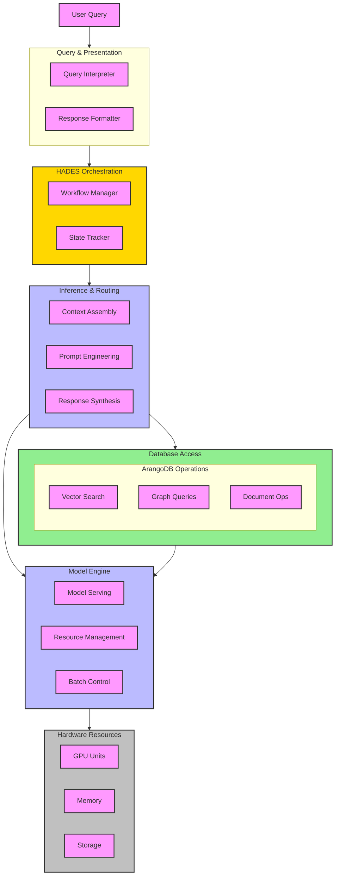

# **HADES: Heuristic Adaptive Data Extraction System**

**Version:** 0.1.0 (Prototype)  
**Last Updated:** 2025-01-28  
**Status:** In Development  

## **1. Introduction**

HADES (Heuristic Adaptive Data Extraction System) is a **bidirectional** knowledge system designed to **retrieve, verify, refine, and update** structured and unstructured knowledge. Unlike traditional RAG (Retrieval-Augmented Generation) implementations, HADES does not function as a passive retriever but rather as an **active participant** in knowledge validation and expansion.

### **1.1. Core Objectives**

1. **Adaptive Knowledge Graph Integration**  
   - Move beyond static retrieval by allowing LLMs to **modify and refine** the knowledge graph dynamically.
   - Implement a **bidirectional flow** where missing context in the knowledge graph is **restored, validated, and reinforced**.

2. **Multi-Modal Knowledge Processing**  
   - Enable structured (graph-based), semi-structured (JSON, YAML), and unstructured (free-text) data integration.
   - Implement **hierarchical negative sampling** and multimodal embeddings for enriched search accuracy.

3. **Incremental Model Adaptation**  
   - Support **lightweight, real-time updates** using **LoRA adapters** or **memory-augmented retrieval**.
   - Minimize catastrophic forgetting by **preserving short-term context** while maintaining long-term knowledge integrity.

4. **Verification and Trust Mechanisms**  
   - Implement **multi-agent validation frameworks** to detect and correct **errors, inconsistencies, and missing relationships** in the knowledge graph.

---

## **2. Architectural Overview**

HADES follows a **layered architecture**, where each layer has **specific responsibilities** and operates independently yet cooperatively.

| **Layer**           | **Function** |
|---------------------|-------------|
| **UI & Session (L7)** | User interaction & session management (Deferred) |
| **Query & Presentation (L6)** | Query parsing, formatting, and response synthesis (Deferred) |
| **HADES Orchestration (L5)** | Workflow and reasoning engine |
| **Inference & Routing (L4)** | Context assembly, task routing, knowledge verification |
| **Database Access (L3)** | Graph queries, vector search, document operations |
| **Model Engine (L2)** | Model serving, embeddings, tensor operations (**Handled in separate document**) |
| **Hardware Resources (L1)** | GPU/Memory/Storage management |



---

## **3. The River Styx Architecture**

HADES implements a unique architectural pattern inspired by Greek mythology's River Styx, creating a natural separation between transient and persistent knowledge.

### **3.1. Mythological Parallel**

| **Mythological Element** | **HADES Component** | **Function** |
|-------------------------|---------------------|--------------|
| River Styx | ECL (Execution Context Layer) | Temporary knowledge state management |
| Charon | InCA (Inference Context Accumulator) | Context management and accumulation |
| The Coin | Storage Directive/Context Threshold | Permission to enter persistent storage |
| The Judges (Minos, Rhadamanthus, Aeacus) | ModernBERT Validation Models | Knowledge validation and persistence decisions |

### **3.2. Knowledge Flow Patterns**

1. **Direct Entry Pattern** ("Born with a coin")
   - Data arrives with explicit storage directives
   - Immediately eligible for judge evaluation
   - Implementation: See `L4_inference_layer_build.md` - Direct Storage Protocol

2. **Accumulation Pattern** ("Earning a coin")
   - Implements InCA/ECL architecture [arXiv:2412.15563v1] for sophisticated context evolution:
     - Tag Generation: Extracts semantic tags and intentions from queries
     - Gaussian Modeling: Models class distributions in embedding space
     - Mahalanobis Distance: Measures semantic relevance to existing knowledge
   - Three-stage context accumulation:
     1. Query → Tags: Generates contextually rich tags using LLM
     2. Tags → Class Selection: Uses Gaussian modeling to identify relevant knowledge domains
     3. Context Assembly: Builds focused context using only relevant class knowledge
   - Automatically triggers judge evaluation when sufficient contextual evidence accumulates
   - Implementation: See `L4_inference_layer_build.md` - InCA/ECL Implementation

3. **Transient Pattern** ("Passing through")
   - Temporary query context
   - Never requires persistence
   - Naturally expires from ECL
   - Implementation: See `L3_database_layer_build.md` - TTL Collections

### **3.3. Practical Implementation**

The River Styx architecture manifests in several key components:

1. **ECL (River Styx)**
   - ArangoDB TTL collections for temporary context
   - Configurable retention periods
   - Reference: `L3_database_layer_build.md` - TTL Configuration

2. **InCA (Charon)**
   - Context scoring and accumulation
   - Threshold monitoring
   - Reference: `L4_inference_layer_build.md` - Context Management

3. **The Judges**
   - Document Judge (Minos) - Document-level decisions
   - Graph Judge (Rhadamanthus) - Relationship validity
   - Embedding Judge (Aeacus) - Entry/classification
   - Reference: `L5_orchestration_layer_build.md` - Judge Implementation

4. **Hades Decoder-Encoder Architecture**

   ```python
   class HadesArchitecture:
       def __init__(self):
           self.encoder = EncoderStack()  # Multi-layer transformer stack
           self.decoder = DecoderStack()  # Autoregressive decoder
           self.judges = JudgeModels()    # CPU-based validation
           
       async def process_query(self, query: str) -> str:
           # Phase 1: Encoding
           encoded_context = await self.encoder.encode(query)
           judge_feedback = await self.judges.validate(encoded_context)
           
           # Phase 2: Iterative Decoding
           for step in range(max_steps):
               # Generate next token
               next_token = await self.decoder.step(
                   encoded_context,
                   judge_feedback
               )
               
               # Get real-time validation
               if next_token.requires_validation:
                   feedback = await self.judges.validate_token(next_token)
                   if not feedback.is_valid:
                       # Backtrack and regenerate
                       continue
                       
               yield next_token
   ```

   The Hades architecture implements:
   - **Encoder Stack**: Processes input query and context into rich embeddings
   - **Decoder Stack**: Generates responses with judge-guided token selection
   - **Cross-Attention**: Allows decoder to reference encoded context
   - **Judge Integration**: Real-time validation during generation

5. **Storage Integration**
   - ArangoDB persistent collections
   - Trust-based tiering
   - Reference: `L3_database_layer_build.md` - Storage Strategy

This architecture ensures:

- Clear separation of transient and persistent knowledge
- Natural filtering mechanism for knowledge persistence
- Efficient resource utilization
- Maintainable and scalable knowledge management

### **3.4. Document Processing Flow**

When a new document arrives, it follows this validation and storage pipeline:

1. **Initial Document Reception**

   ```python
   async def process_new_document(doc: Dict[str, Any]) -> bool:
       # Phase 1: Judge Processing
       judge_results = await process_through_judges(doc)
       if not judge_results.all_validated:
           return False
           
       # Phase 2: Storage Operations
       return await store_validated_results(judge_results)
   ```

2. **Judge Processing Pipeline**

   ```python
   async def process_through_judges(doc: Dict[str, Any]) -> JudgeResults:
       # Parallel Processing Through Judges
       results = await asyncio.gather(
           minos.validate_content(doc),      # Document validation
           rhadamanthus.extract_edges(doc),  # Graph relationships
           aeacus.generate_embedding(doc)    # Vector embedding
       )
       return JudgeResults(*results)
   ```

3. **ArangoDB Storage Operations**

   ```python
   async def store_validated_results(results: JudgeResults) -> bool:
       # AQL Operations for Storage
       aql_operations = [
           # Store document with metadata
           """
           INSERT { 
               _key: @docKey, 
               content: @content,
               metadata: @metadata,
               validation_score: @score
           } INTO documents
           """,
           
           # Store vector embedding
           """
           INSERT { 
               _key: @docKey,
               vector: @embedding,
               dim: @dimensions
           } INTO embeddings
           """,
           
           # Create graph edges
           """
           FOR edge IN @edges
               INSERT {
                   _from: @docKey,
                   _to: edge.target,
                   type: edge.type,
                   confidence: edge.score
               } INTO relationships
           """
       ]
       
       # Execute operations in transaction
       return await execute_aql_transaction(aql_operations, results)
   ```

4. **Transaction Execution**

   ```python
   async def execute_aql_transaction(operations: List[str], data: JudgeResults) -> bool:
       try:
           async with db.begin_transaction() as txn:
               # Execute all AQL operations atomically
               for op in operations:
                   await txn.execute(op, bind_vars={
                       'docKey': data.document_key,
                       'content': data.content,
                       'metadata': data.metadata,
                       'score': data.validation_score,
                       'embedding': data.embedding.tolist(),
                       'dimensions': len(data.embedding),
                       'edges': data.graph_edges
                   })
               return True
       except Exception as e:
           logger.error(f"Transaction failed: {e}")
           return False
   ```

This flow ensures:

1. **Atomic Operations**: All storage operations succeed or fail together
2. **Data Consistency**: Document, embedding, and graph edges remain in sync
3. **Validation**: Each judge's criteria must be met before storage
4. **Traceability**: Full metadata and validation scores are stored

The judges don't directly execute AQL - instead, they:

1. Minos → Validates content and generates metadata
2. Rhadamanthus → Identifies relationships as edge definitions
3. Aeacus → Generates vector embeddings

Their outputs are then translated into appropriate AQL operations by the storage layer.

### **3.5. Context Augmentation Flow**

The decoder model acts as an intelligent mediator between the judges' insights and the encoder's context:

```python
class HadesContextFlow:
    async def process_query(self, query: str) -> str:
        # Phase 1: Initial Context Retrieval
        base_context = await self.db.get_relevant_context(query)
        
        # Phase 2: Judge Analysis
        judge_insights = await asyncio.gather(
            self.minos.analyze_context(base_context),      # Document validation
            self.rhadamanthus.analyze_relations(base_context),  # Graph analysis
            self.aeacus.analyze_embeddings(base_context)   # Vector space analysis
        )
        
        # Phase 3: Decoder Integration
        augmented_context = await self.decoder.integrate_insights(
            original_context=base_context,
            judge_insights=judge_insights,
            query_intent=query
        )
        
        # Phase 4: Enhanced Encoding
        return await self.encoder.encode_with_augmented_context(
            query=query,
            context=augmented_context
        )

class HadesDecoder:
    async def integrate_insights(
        self, 
        original_context: Dict,
        judge_insights: List[JudgeInsight],
        query_intent: str
    ) -> AugmentedContext:
        # Step 1: Analyze judge feedback
        context_scores = {
            'document_relevance': judge_insights[0].relevance_score,
            'graph_connectivity': judge_insights[1].connection_strength,
            'embedding_proximity': judge_insights[2].vector_similarity
        }
        
        # Step 2: Identify context gaps
        gaps = self.identify_context_gaps(
            original_context,
            context_scores,
            query_intent
        )
        
        # Step 3: Request additional context if needed
        if gaps:
            additional_context = await self.fetch_gap_filling_context(gaps)
            original_context = self.merge_contexts(
                original_context, 
                additional_context
            )
        
        # Step 4: Apply judge-based weightings
        weighted_context = self.apply_judge_weights(
            original_context,
            context_scores
        )
        
        return AugmentedContext(
            content=weighted_context,
            metadata={
                'judge_scores': context_scores,
                'gaps_filled': bool(gaps),
                'context_quality': self.calculate_quality_score(weighted_context)
            }
        )
```

This flow demonstrates how:

1. **Judges Augment Context**
   - Analyze retrieved context from different perspectives
   - Provide relevance scores and validation metrics
   - Identify potential context gaps

2. **Decoder Acts as Mediator**
   - Integrates insights from all judges
   - Identifies and fills context gaps
   - Applies judge-based weightings to context
   - Ensures context quality before encoding

3. **Encoder Benefits**
   - Receives judge-validated context
   - Gets context with filled gaps
   - Has access to relevance scores
   - Can focus on semantic understanding

4. **Quality Control**
   - Context gaps are identified and filled
   - Multiple validation perspectives
   - Quality scores for tracking
   - Metadata for debugging

This creates a feedback loop where:

1. Judges validate and analyze context
2. Decoder integrates their insights
3. Encoder uses enhanced context
4. Better context → Better encoding → Better retrieval

---

## **3.6. Database Landscape vs Content Context**

HADES implements two distinct types of updates:

1. **Database Landscape Updates** (Encoder-Decoder-Judge Pipeline)

   ```python
   async def update_database_landscape(data: Dict[str, Any]) -> UpdateResult:
       """Updates how data is connected and stored within ArangoDB"""
       # Judges analyze database structure
       landscape_analysis = await asyncio.gather(
           minos.analyze_storage_patterns(data),     # Document storage patterns
           rhadamanthus.analyze_connections(data),   # Existing relationships
           aeacus.analyze_vector_clusters(data)      # Embedding distributions
       )
       
       # Decoder determines optimal storage strategy
       storage_decision = await decoder.optimize_storage(
           analysis=landscape_analysis,
           current_layout=await db.get_collection_stats()
       )
       
       # Update database organization
       return await db.apply_storage_optimization(
           strategy=storage_decision,
           metadata={'analysis': landscape_analysis}
       )
   ```

2. **Content Context Updates** (ECL - External Context Layer)

   ```python
   async def update_content_context(
       domain: str,
       context_source: Union[str, Path]
   ) -> ContextResult:
       """Updates understanding of specific knowledge domain or filesystem"""
       # ECL handles domain-specific context
       if is_filesystem_context(context_source):
           # Update context about file/directory structure
           return await ecl.update_filesystem_context(
               path=context_source,
               existing_context=current_context.get(domain)
           )
       else:
           # Update domain-specific knowledge context
           return await ecl.update_knowledge_context(
               domain=domain,
               source=context_source,
               existing_context=current_context.get(domain)
           )
   ```

**Key Differences:**

1. **Database Landscape Updates**
   - Focus on HOW data is stored and connected
   - Optimize database structure and relationships
   - Judges analyze storage patterns and connections
   - Decoder optimizes database organization
   - Results in AQL operations for restructuring

2. **ECL Context Updates**
   - Focus on WHAT the data means
   - Build understanding of specific domains
   - Independent of storage structure
   - Can handle both knowledge and filesystem contexts
   - Results in updated contextual understanding

**Example Scenarios:**

```python
# Scenario 1: Database Landscape Update
await update_database_landscape({
    'collection': 'documents',
    'pattern': 'frequent_access_to_related_nodes',
    'suggestion': 'create_edge_index_for_performance'
})

# Scenario 2: ECL Context Update
await update_content_context(
    domain='python_codebase',
    context_source=Path('/path/to/project')
)
```

This separation ensures:

1. Database optimization happens independently of content understanding
2. Domain-specific context can evolve without affecting storage structure
3. Both systems can work in parallel to improve different aspects
4. Clear responsibility separation between storage and meaning

The system maintains two key collections in ArangoDB:

- `documents`: Main document store with embeddings
- `training_samples`: Temporary store for negative samples

Training Schedule:

1. Daily: Generate negative samples for new documents
2. Weekly: Full training run during maintenance window
3. Monthly: Clean up old training data and validate model

---

## **3.7. Batch Training and Negative Sampling**

HADES implements an efficient batch training strategy using ArangoDB's capabilities:

```python
class BatchTrainingOrchestrator:
    async def schedule_training_job(self):
        """Weekly training job scheduled during low-usage periods"""
        # Step 1: Collect candidates for negative sampling
        candidates = await self.db.run_query("""
            FOR doc IN documents
            FILTER doc.last_accessed >= DATE_SUBTRACT(DATE_NOW(), "P7D")
            SORT doc.access_count DESC
            LIMIT 1000
            RETURN {
                _key: doc._key,
                embedding: doc.embedding,
                context: doc.context
            }
        """)
        
        # Step 2: Generate negative samples in batches
        negative_samples = await self.generate_batch_negatives(candidates)
        
        # Step 3: Store in ArangoDB's training collection
        await self.db.run_query("""
            FOR sample IN @samples
            INSERT {
                _key: CONCAT('neg_', sample.original_key),
                original_doc: sample.original_key,
                negative_embedding: sample.embedding,
                generated_at: DATE_NOW(),
                training_metadata: sample.metadata
            } INTO training_samples
        """, bind_vars={'samples': negative_samples})

    async def generate_batch_negatives(
        self, 
        candidates: List[Dict]
    ) -> List[Dict]:
        """Generate negative samples in parallel"""
        tasks = []
        for doc in candidates:
            tasks.append(self.diffusion_sampler.generate(
                doc['embedding'],
                doc['context'],
                n_samples=5
            ))
        
        results = await asyncio.gather(*tasks)
        return [
            {
                'original_key': doc['_key'],
                'embedding': neg_sample,
                'metadata': {
                    'generation_method': 'diffusion',
                    'original_context': doc['context']
                }
            }
            for doc, neg_samples in zip(candidates, results)
            for neg_sample in neg_samples
        ]

    async def run_weekly_training(self):
        """Execute training during maintenance window"""
        # Step 1: Get stored negative samples
        training_data = await self.db.run_query("""
            FOR sample IN training_samples
            FILTER sample.generated_at >= DATE_SUBTRACT(DATE_NOW(), "P7D")
            RETURN sample
        """)
        
        # Step 2: Update embeddings model
        await self.model.train_batch(
            positive_examples=training_data['original_docs'],
            negative_examples=training_data['negative_samples']
        )
        
        # Step 3: Clean up old samples
        await self.db.run_query("""
            FOR sample IN training_samples
            FILTER sample.generated_at < DATE_SUBTRACT(DATE_NOW(), "P7D")
            REMOVE sample IN training_samples
        """)
```

This approach provides several benefits:

1. **Resource Optimization**
   - Negative sampling happens during off-peak hours
   - Batch processing reduces system load
   - Training data is pre-generated and stored

2. **Storage Efficiency**
   - ArangoDB manages training data lifecycle
   - Automatic cleanup of old samples
   - Structured storage of training metadata

3. **Training Improvements**
   - More comprehensive negative samples
   - Better coverage of recent data
   - Parallel processing for generation

4. **Operational Benefits**
   - Scheduled maintenance windows
   - No impact on real-time operations
   - Clear training data lineage

The system maintains two key collections in ArangoDB:

- `documents`: Main document store with embeddings
- `training_samples`: Temporary store for negative samples

Training Schedule:

1. Daily: Generate negative samples for new documents
2. Weekly: Full training run during maintenance window
3. Monthly: Clean up old training data and validate model

### **Implementation Notes for Batch Training**

The following aspects will need to be addressed during the implementation phase:

1. **Monitoring and Metrics**
   - [ ] Batch process performance tracking
   - [ ] Sample generation success rates
   - [ ] Training completion metrics
   - [ ] Resource utilization during batch windows

2. **ArangoDB Task Scheduling**
   - [ ] Integration with native scheduler
   - [ ] Task priority management
   - [ ] Resource allocation controls
   - [ ] Multi-node coordination

3. **Fallback Strategies**
   - [ ] Handling missed training windows
   - [ ] Backup scheduling logic
   - [ ] Data consistency checks
   - [ ] Recovery procedures

4. **Sample Validation**
   - [ ] Quality metrics for generated samples
   - [ ] Validation pipeline
   - [ ] Rejection criteria
   - [ ] Sample diversity checks

These items are not blocking for initial implementation but must be addressed during the build phase to ensure production readiness.

---

## **4. Core Innovations & Bidirectional Flow**

HADES integrates **LLMs and Knowledge Graphs** as mutually reinforcing systems. Instead of **just retrieving knowledge**, the system **identifies gaps, refines context, and updates the graph dynamically**.

### **4.1. Feedback Loop & Adaptive Learning**

1. **Query → Subgraph Retrieval**  
   - HADES retrieves the most relevant **vector embeddings, graph nodes, and metadata**.
2. **LLM Analysis & Missing Context Identification**  
   - The LLM examines the retrieved subgraph and **identifies missing relationships**.
   - **Example:** If a query about Albert Einstein's Nobel Prize omits his contribution to the **Photoelectric Effect**, the system flags the omission.
3. **Secondary Retrieval Based on Missing Data**  
   - HADES refines the query and **expands its search**, retrieving additional knowledge.
4. **LLM Generates Response + Suggested KG Updates**  
   - If errors or missing links are detected, the LLM suggests **new relationships**.
5. **Knowledge Graph Update & Validation**  
   - The system **does not immediately modify the graph**—instead, it uses **trust scoring & validation mechanisms** before updates.

### **4.2. Trust & Validation Mechanisms**

To prevent knowledge corruption, all LLM-suggested KG updates undergo **multi-agent validation**.

✅ **Agent-Based Scoring:**  

- **Agent 1:** Context Checker → Ensures the update aligns with existing context.  
- **Agent 2:** Consistency Checker → Detects conflicts with known relationships.  
- **Agent 3:** Accuracy Checker → Validates against external sources or embeddings.  
- **Agent 4:** Human-In-The-Loop (Optional) → For critical updates, human review may be required.

---

## **5. Future Expansion: Moving Toward Online Learning**

### **5.1. Lightweight Model Updates**

Instead of **full model retraining**, HADES will support **incremental fine-tuning** with **LoRA** or **ephemeral memory storage**.

| **Method** | **Use Case** | **Pros** | **Cons** |
|------------|-------------|----------|----------|
| **LoRA Fine-Tuning** | Update domain knowledge | Lightweight, efficient | Requires checkpoint management |
| **Memory-Augmented Retrieval** | Temporary in-session adaptation | No retraining needed | Forgetful over time |

### **5.2. Multi-Modal Knowledge Graph Expansion**

HADES will evolve to process **text, structured data, and multimodal content (code, images, time-series data, etc.)**.

✅ **Diffusion-Based Hierarchical Negative Sampling**  

- Improves **embedding relevance** by refining negative triplet selection.  
- Enhances **semantic quality of vector retrieval**.

✅ **Graph-Specific Transformers**  

- Future implementation may include **graph transformers** that directly process structured relationships.

---

## **6. Development Roadmap**

| **Phase** | **Focus Area** | **Key Deliverables** |
|-----------|---------------|----------------------|
| **Phase 1** | Establish Feedback Loop | Bidirectional retrieval and basic KG updates |
| **Phase 2** | Implement Multi-Agent Validation | Error detection and verification |
| **Phase 3** | Introduce Online Learning | LoRA-based or memory-augmented retrieval |
| **Phase 4** | Expand Multi-Modal Capabilities | Hierarchical embeddings and multimodal KG |

---

## **7. Conclusion**

HADES represents the **next evolution** of Retrieval-Augmented Generation, transforming from a **passive retriever** into an **adaptive intelligence system** capable of **reasoning, validating, and evolving its knowledge graph dynamically**.

---

## **8. Next Steps**

1. **Finalize backend structure (Layers 3, 4, and 5)**.  
2. **Implement first iteration of bidirectional retrieval & update mechanism**.  
3. **Prototype validation agents and trust scoring system**.  
4. **Explore lightweight model adaptation strategies (LoRA or ephemeral memory)**.  
5. **Plan multi-modal retrieval expansion for future phases**.

---

This document provides the **architectural and theoretical framework** for HADES. Next, we'll move on to the **HADES-build_guidelines.md** to detail **implementation steps and technical specifications**.

---

Let me know if you want any refinements before we move forward with the build guidelines! 🚀
