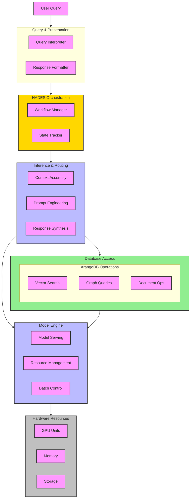

# **HADES: Heuristic Adaptive Data Extraction System**

**Version:** 0.1.0 (Prototype)  
**Last Updated:** 2025-01-28  
**Status:** In Development  

## **1. Introduction**

HADES (Heuristic Adaptive Data Extraction System) is a **bidirectional** knowledge system designed to **retrieve, verify, refine, and update** structured and unstructured knowledge. Unlike traditional RAG (Retrieval-Augmented Generation) implementations, HADES does not function as a passive retriever but rather as an **active participant** in knowledge validation and expansion.

### **1.1. Core Objectives**

1. **Adaptive Knowledge Graph Integration**  
   - Move beyond static retrieval by allowing LLMs to **modify and refine** the knowledge graph dynamically.
   - Implement a **bidirectional flow** where missing context in the knowledge graph is **restored, validated, and reinforced**.

2. **Multi-Modal Knowledge Processing**  
   - Enable structured (graph-based), semi-structured (JSON, YAML), and unstructured (free-text) data integration.
   - Implement **hierarchical negative sampling** and multimodal embeddings for enriched search accuracy.

3. **Incremental Model Adaptation**  
   - Support **lightweight, real-time updates** using **LoRA adapters** or **memory-augmented retrieval**.
   - Minimize catastrophic forgetting by **preserving short-term context** while maintaining long-term knowledge integrity.

4. **Verification and Trust Mechanisms**  
   - Implement **multi-agent validation frameworks** to detect and correct **errors, inconsistencies, and missing relationships** in the knowledge graph.

---

## **2. Architectural Overview**

HADES follows a **layered architecture**, where each layer has **specific responsibilities** and operates independently yet cooperatively.

| **Layer**           | **Function** |
|---------------------|-------------|
| **UI & Session (L7)** | User interaction & session management (Deferred) |
| **Query & Presentation (L6)** | Query parsing, formatting, and response synthesis (Deferred) |
| **HADES Orchestration (L5)** | Workflow and reasoning engine |
| **Inference & Routing (L4)** | Context assembly, task routing, knowledge verification |
| **Database Access (L3)** | Graph queries, vector search, document operations |
| **Model Engine (L2)** | Model serving, embeddings, tensor operations (**Handled in separate document**) |
| **Hardware Resources (L1)** | GPU/Memory/Storage management |

---

## **3. The River Styx Architecture**

HADES implements a unique architectural pattern inspired by Greek mythology's River Styx, creating a natural separation between transient and persistent knowledge.

### **3.1. Mythological Parallel**

| **Mythological Element** | **HADES Component** | **Function** |
|-------------------------|---------------------|--------------|
| River Styx | ECL (Execution Context Layer) | Temporary knowledge state management |
| Charon | InCA (Inference Context Accumulator) | Context management and accumulation |
| The Coin | Storage Directive/Context Threshold | Permission to enter persistent storage |
| The Judges (Minos, Rhadamanthus, Aeacus) | ModernBERT Validation Models | Knowledge validation and persistence decisions |

### **3.2. Knowledge Flow Patterns**

1. **Direct Entry Pattern** ("Born with a coin")
   - Data arrives with explicit storage directives
   - Immediately eligible for judge evaluation
   - Implementation: See `L4_inference_layer_build.md` - Direct Storage Protocol

2. **Accumulation Pattern** ("Earning a coin")
   - Implements InCA/ECL architecture [arXiv:2412.15563v1] for sophisticated context evolution:
     - Tag Generation: Extracts semantic tags and intentions from queries
     - Gaussian Modeling: Models class distributions in embedding space
     - Mahalanobis Distance: Measures semantic relevance to existing knowledge
   - Three-stage context accumulation:
     1. Query → Tags: Generates contextually rich tags using LLM
     2. Tags → Class Selection: Uses Gaussian modeling to identify relevant knowledge domains
     3. Context Assembly: Builds focused context using only relevant class knowledge
   - Automatically triggers judge evaluation when sufficient contextual evidence accumulates
   - Implementation: See `L4_inference_layer_build.md` - InCA/ECL Implementation

3. **Transient Pattern** ("Passing through")
   - Temporary query context
   - Never requires persistence
   - Naturally expires from ECL
   - Implementation: See `L3_database_layer_build.md` - TTL Collections

### **3.3. Practical Implementation**

The River Styx architecture manifests in several key components:

1. **ECL (River Styx)**
   - ArangoDB TTL collections for temporary context
   - Configurable retention periods
   - Reference: `L3_database_layer_build.md` - TTL Configuration

2. **InCA (Charon)**
   - Context scoring and accumulation
   - Threshold monitoring
   - Reference: `L4_inference_layer_build.md` - Context Management

3. **The Judges**
   - Document Judge (Minos) - Document-level decisions
   - Graph Judge (Rhadamanthus) - Relationship validity
   - Embedding Judge (Aeacus) - Entry/classification
   - Reference: `L5_orchestration_layer_build.md` - Judge Implementation

4. **Storage Integration**
   - ArangoDB persistent collections
   - Trust-based tiering
   - Reference: `L3_database_layer_build.md` - Storage Strategy

This architecture ensures:

- Clear separation of transient and persistent knowledge
- Natural filtering mechanism for knowledge persistence
- Efficient resource utilization
- Maintainable and scalable knowledge management

---

## **4. Core Innovations & Bidirectional Flow**

HADES integrates **LLMs and Knowledge Graphs** as mutually reinforcing systems. Instead of **just retrieving knowledge**, the system **identifies gaps, refines context, and updates the graph dynamically**.

### **4.1. Feedback Loop & Adaptive Learning**

1. **Query → Subgraph Retrieval**  
   - HADES retrieves the most relevant **vector embeddings, graph nodes, and metadata**.
2. **LLM Analysis & Missing Context Identification**  
   - The LLM examines the retrieved subgraph and **identifies missing relationships**.
   - **Example:** If a query about Albert Einstein's Nobel Prize omits his contribution to the **Photoelectric Effect**, the system flags the omission.
3. **Secondary Retrieval Based on Missing Data**  
   - HADES refines the query and **expands its search**, retrieving additional knowledge.
4. **LLM Generates Response + Suggested KG Updates**  
   - If errors or missing links are detected, the LLM suggests **new relationships**.
5. **Knowledge Graph Update & Validation**  
   - The system **does not immediately modify the graph**—instead, it uses **trust scoring & validation mechanisms** before updates.

### **4.2. Trust & Validation Mechanisms**

To prevent knowledge corruption, all LLM-suggested KG updates undergo **multi-agent validation**.

✅ **Agent-Based Scoring:**  

- **Agent 1:** Context Checker → Ensures the update aligns with existing context.  
- **Agent 2:** Consistency Checker → Detects conflicts with known relationships.  
- **Agent 3:** Accuracy Checker → Validates against external sources or embeddings.  
- **Agent 4:** Human-In-The-Loop (Optional) → For critical updates, human review may be required.

---

## **5. Future Expansion: Moving Toward Online Learning**

### **5.1. Lightweight Model Updates**

Instead of **full model retraining**, HADES will support **incremental fine-tuning** with **LoRA** or **ephemeral memory storage**.

| **Method** | **Use Case** | **Pros** | **Cons** |
|------------|-------------|----------|----------|
| **LoRA Fine-Tuning** | Update domain knowledge | Lightweight, efficient | Requires checkpoint management |
| **Memory-Augmented Retrieval** | Temporary in-session adaptation | No retraining needed | Forgetful over time |

### **5.2. Multi-Modal Knowledge Graph Expansion**

HADES will evolve to process **text, structured data, and multimodal content (code, images, time-series data, etc.)**.

✅ **Diffusion-Based Hierarchical Negative Sampling**  

- Improves **embedding relevance** by refining negative triplet selection.  
- Enhances **semantic quality of vector retrieval**.

✅ **Graph-Specific Transformers**  

- Future implementation may include **graph transformers** that directly process structured relationships.

---

## **6. Development Roadmap**

| **Phase** | **Focus Area** | **Key Deliverables** |
|-----------|---------------|----------------------|
| **Phase 1** | Establish Feedback Loop | Bidirectional retrieval and basic KG updates |
| **Phase 2** | Implement Multi-Agent Validation | Error detection and verification |
| **Phase 3** | Introduce Online Learning | LoRA-based or memory-augmented retrieval |
| **Phase 4** | Expand Multi-Modal Capabilities | Hierarchical embeddings and multimodal KG |

---

## **7. Conclusion**

HADES represents the **next evolution** of Retrieval-Augmented Generation, transforming from a **passive retriever** into an **adaptive intelligence system** capable of **reasoning, validating, and evolving its knowledge graph dynamically**.

---

## **8. Next Steps**

1. **Finalize backend structure (Layers 3, 4, and 5)**.  
2. **Implement first iteration of bidirectional retrieval & update mechanism**.  
3. **Prototype validation agents and trust scoring system**.  
4. **Explore lightweight model adaptation strategies (LoRA or ephemeral memory)**.  
5. **Plan multi-modal retrieval expansion for future phases**.

---

This document provides the **architectural and theoretical framework** for HADES. Next, we'll move on to the **HADES-build_guidelines.md** to detail **implementation steps and technical specifications**.

---

Let me know if you want any refinements before we move forward with the build guidelines! 🚀
