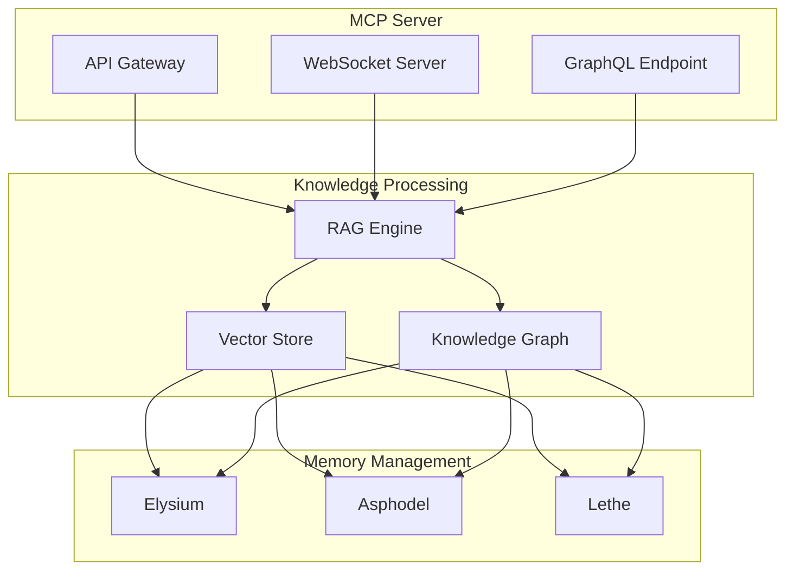

# HADES Build Document

**Version:** 1.0.0  
**Last Updated:** 2025-01-23  
**Status:** Development  
**Component:** HADES (Heuristic Adaptive Data Extraction System)

## Overview

HADES serves as the core backend system for Project Olympus, providing intelligent data management, knowledge processing, and API services. It implements a tiered memory architecture and integrates with vector stores and knowledge graphs for efficient information retrieval and storage.

## Core Features

### 1. Memory Management

- **Elysium Tier**: Hot data, immediate access
- **Asphodel Tier**: Warm data, cached access
- **Lethe Tier**: Cold data, archived storage

### 2. Knowledge Processing

- RAG-enabled query processing
- Vector similarity search
- Knowledge graph traversal
- Contextual information retrieval

### 3. API/MCP Server

- Message Control Protocol
- RESTful API endpoints
- WebSocket connections
- GraphQL interface

## System Architecture

### Component Structure



## Technical Requirements

### System Dependencies

- Python 3.12+
- ArangoDB 3.11+
- FAISS/Milvus
- Redis 7.0+

### Core Libraries

```toml
[dependencies]
aiohttp = "^3.9.1"
arangodb = "^7.7.0"
fastapi = "^0.104.1"
pydantic = "^2.5.2"
redis = "^5.0.1"
sentence-transformers = "^2.2.2"
```

## Implementation Details

### 1. Memory Management

```python
class MemoryTier(Enum):
    ELYSIUM = "elysium"
    ASPHODEL = "asphodel"
    LETHE = "lethe"

class MemoryManager:
    def store(self, data: Dict, tier: MemoryTier) -> str:
        """Store data in specified memory tier."""
        
    def retrieve(self, key: str) -> Optional[Dict]:
        """Retrieve data from appropriate tier."""
        
    def migrate(self, key: str, from_tier: MemoryTier, to_tier: MemoryTier):
        """Migrate data between tiers."""
```

### 2. Knowledge Processing

```python
class KnowledgeProcessor:
    def __init__(self):
        self.rag_engine = RAGEngine()
        self.vector_store = VectorStore()
        self.knowledge_graph = KnowledgeGraph()
    
    async def process_query(self, query: str) -> Dict:
        """Process query using RAG and knowledge stores."""
        
    async def update_knowledge(self, data: Dict):
        """Update knowledge stores with new information."""
```

### 3. MCP Server

```python
class MCPServer:
    def __init__(self):
        self.app = FastAPI()
        self.knowledge_processor = KnowledgeProcessor()
        self.memory_manager = MemoryManager()
    
    async def handle_request(self, request: Dict) -> Dict:
        """Handle incoming MCP requests."""
```

## Development Setup

### Local Environment

```bash
# Create virtual environment
python -m venv venv
source venv/bin/activate

# Install dependencies
pip install -r requirements.txt

# Setup pre-commit hooks
pre-commit install

# Start development servers
docker-compose up -d  # For databases
python src/main.py
```

### Configuration

```yaml
# config/development.yaml
memory:
  elysium:
    type: redis
    ttl: 3600
  asphodel:
    type: vector_store
    ttl: 86400
  lethe:
    type: object_store
    ttl: null

knowledge:
  vector_store:
    type: faiss
    dimension: 768
  graph:
    type: arangodb
    collections:
      - nodes
      - edges
```

## Testing

### Unit Tests

```bash
pytest tests/unit/
```

### Integration Tests

```bash
pytest tests/integration/
```

### Performance Tests

```bash
pytest tests/performance/
```

## Monitoring

### Metrics

- Query latency
- Memory usage per tier
- Knowledge graph operations
- Vector store performance

### Logging

```python
logger = logging.getLogger("hades")
logger.setLevel(logging.INFO)
```

## Security

### Authentication

- JWT-based authentication
- API key validation
- Role-based access control

### Data Protection

- Encryption at rest
- Secure communication
- Access logging

## API Documentation

### REST API

- `/api/v1/query`: Process queries
- `/api/v1/store`: Store data
- `/api/v1/retrieve`: Retrieve data

### WebSocket

- `ws://host/mcp`: MCP communication
- `ws://host/events`: Event streaming

### GraphQL

- `/graphql`: GraphQL endpoint

## Deployment

### Docker

```dockerfile
FROM python:3.12-slim
WORKDIR /app
COPY . .
RUN pip install -r requirements.txt
CMD ["python", "src/main.py"]
```

### Kubernetes

```yaml
apiVersion: apps/v1
kind: Deployment
metadata:
  name: hades
spec:
  replicas: 3
  template:
    spec:
      containers:
      - name: hades
        image: olympus/hades:latest
```

## Next Steps

1. **Core Implementation**
   - Complete memory management
   - Implement RAG engine
   - Set up MCP server

2. **Integration**
   - Connect with Model Engine
   - Interface with Agents
   - Set up monitoring

3. **Testing & Deployment**
   - Write test suite
   - Setup CI/CD
   - Deploy monitoring
