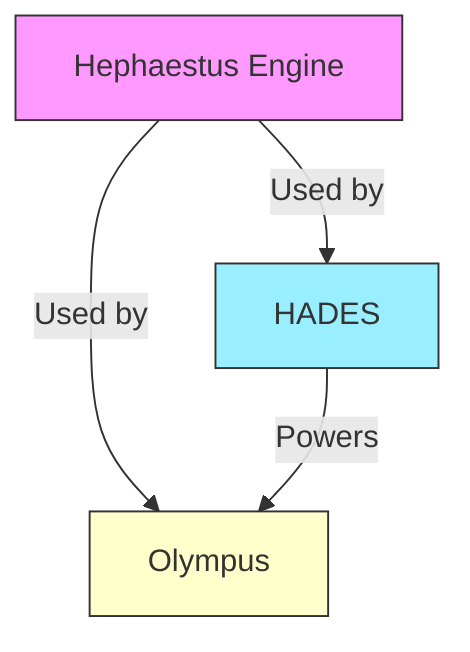
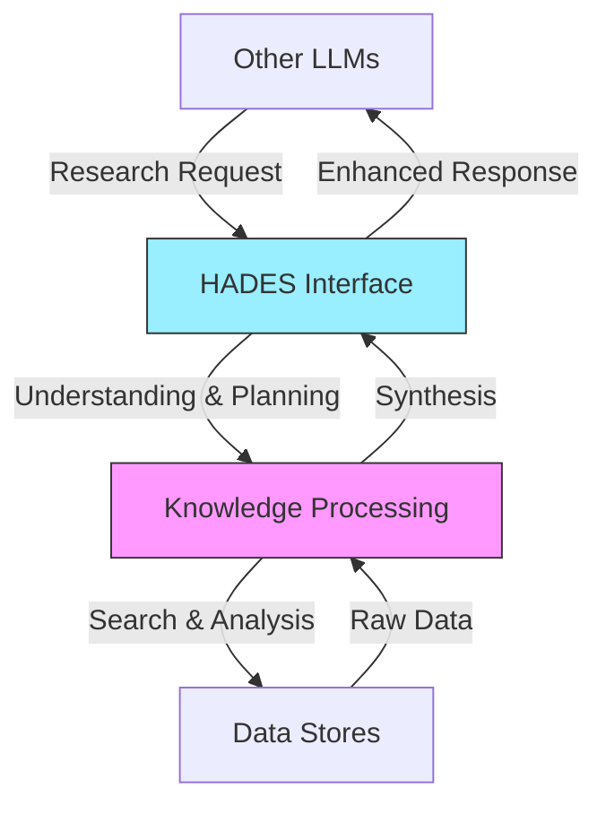
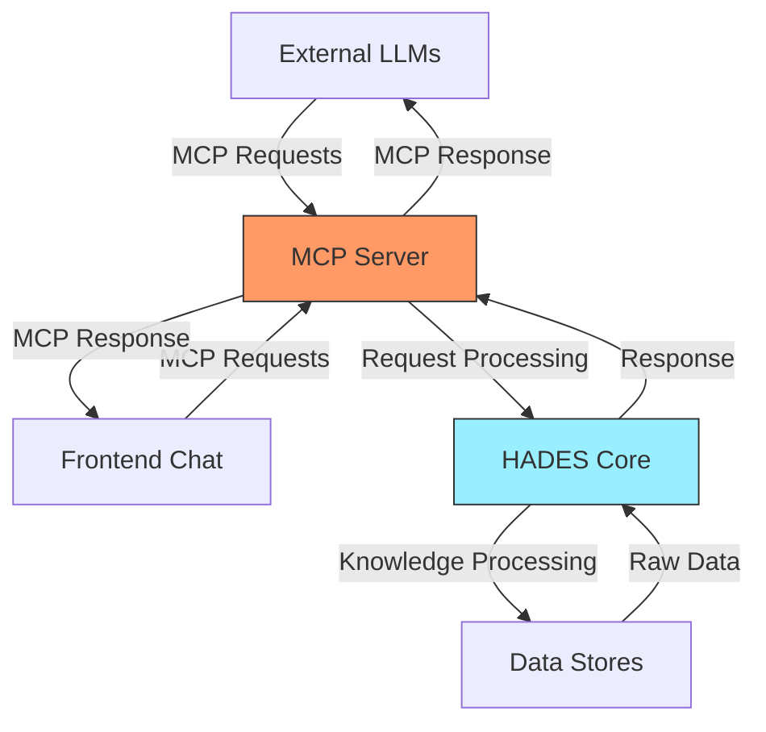
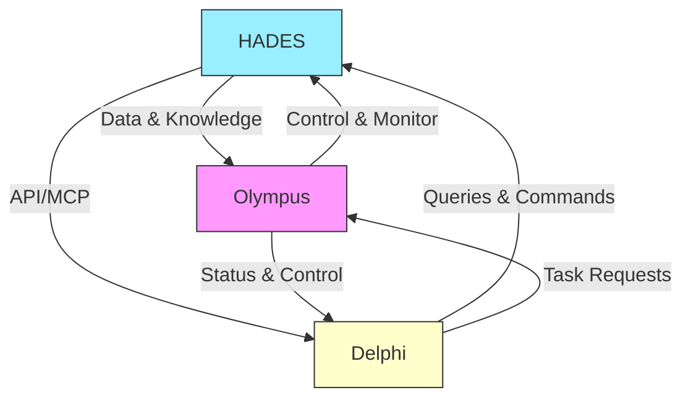

# Build Document for HADES (Heuristic Adaptive Data Extraction System)

## Repository Structure

HADES is part of a larger ecosystem consisting of three main repositories:

1. **Hephaestus Engine** (Independent Model Management)
   - Model discovery and loading
   - Resource management
   - Configuration handling
   - Used by both HADES and Olympus

2. **HADES** (Current Repository)
   - RAG system implementation
   - Agent management
   - Database integration
   - Can be used independently or as part of Olympus

3. **Olympus** (Main Project)
   - Integrates HADES and Hephaestus
   - Higher-level functionality
   - System orchestration

### Dependencies Between Components



## 1. HADES Core Identity and Role

HADES (Heuristic Adaptive Data Extraction System) functions as an intelligent librarian/archivist entity within the Olympus ecosystem. Unlike traditional database systems that simply store and retrieve data, HADES acts as a knowledgeable curator and interpreter of information.

### Core Philosophy

HADES operates on the principle of being an independent entity with its own understanding and capabilities, rather than just a passive data store. It maintains deep knowledge of its contents and can provide enriched, contextual responses to queries.

### Role as Knowledge Steward

1. **Information Curation**
   - Maintains and organizes information across various datastores
   - Understands deep semantic and relational connections
   - Preserves context and provenance of information
   - Actively manages information lifecycle across memory tiers

2. **Interaction Model**
   - Acts as a librarian to other LLMs ("patrons")
   - Receives and interprets research requests with context
   - Provides enriched responses with additional relevant context
   - Maintains professional boundaries and access controls

3. **Knowledge Synthesis**
   - Combines multiple types of relationships:
     - Semantic (meaning/topic connections)
     - Relational (database/graph connections)
     - Temporal (historical context and changes)
     - Source-based (documentation and origins)
   - Provides enhanced context based on comprehensive understanding
   - Identifies and explains relevant connections

4. **Responsibility and Ethics**
   - Maintains data integrity and accuracy
   - Preserves source attribution and provenance
   - Ensures appropriate access controls
   - Provides balanced and comprehensive information

### Interaction Patterns



## 2. System Architecture

### 2.1 MCP Interface Layer

HADES implements the Model Context Protocol (MCP) as its primary interface layer, providing a standardized way for both LLMs and human users to interact with the system.

#### MCP Server Architecture



1. **Universal Interface**
   - Single standardized protocol for all interactions
   - Consistent request/response patterns
   - Built-in context handling
   - Structured tool definitions

2. **LLM Integration**
   - Other LLMs connect as research patrons
   - Standardized query format
   - Context preservation across interactions
   - Tool-based access to HADES capabilities

3. **Frontend Integration**
   - Chat interface uses same MCP protocol
   - Real-time streaming responses
   - Interactive tool usage
   - Session context management

4. **MCP Tool Definitions**
   ```json
   {
     "tools": [
       {
         "name": "search_knowledge",
         "description": "Search across HADES knowledge stores with context",
         "parameters": {
           "query": "string",
           "context": "object",
           "search_type": ["semantic", "relational", "hybrid"]
         }
       },
       {
         "name": "analyze_relationships",
         "description": "Analyze relationships between pieces of information",
         "parameters": {
           "entities": "array",
           "relationship_types": ["semantic", "temporal", "causal"]
         }
       }
     ]
   }
   ```

5. **Security and Access Control**
   - Authentication via MCP protocol
   - Role-based access control
   - Request validation and sanitization
   - Rate limiting and quota management

### 2.2 Agent Architecture

#### LangChain Integration

```bash
# Install LangChain and related dependencies
pip install langchain langchain-core langchain-community
pip install langchain-experimental
```

#### LangGraph Setup

```bash
# Install LangGraph for agent orchestration
pip install langgraph
```

## 3. Prerequisites

- Node.js (LTS version recommended)
- npm (package manager)
- Docker (optional for containerized installation)
- python 3.10+ with pip
- CUDA-compatible GPU (recommended)

## 4. Base Environment Setup

### 4.1 RAM Disk Configuration

```bash
# Create 64GB RAM Disk for model hot-swapping
sudo mkdir /mnt/ramdisk
sudo mount -t tmpfs -o size=64G tmpfs /mnt/ramdisk

# Add to /etc/fstab for persistence
echo "tmpfs /mnt/ramdisk tmpfs size=64G 0 0" | sudo tee -a /etc/fstab
```

### 4.2 Python Environment Setup

```bash
# Create and activate virtual environment
python -m venv .venv
source .venv/bin/activate

# Install base dependencies
pip install torch torchvision torchaudio
pip install transformers accelerate
pip install python-dotenv
```

## 5. Database Setup

### 5.1 Local Installation of ArangoDB

#### Dependencies

1. Add the ArangoDB repository:

    ```bash
    wget -q https://download.arangodb.com/arangodb42/DEBIAN/Release.key -O- | sudo apt-key add -
    echo 'deb https://download.arangodb.com/arangodb42/DEBIAN/ /' | sudo tee /etc/apt/sources.list.d/arangodb.list
    ```

2. Install ArangoDB:

    ```bash
    sudo apt-get update
    sudo apt-get install -y arangodb3
    ```

3. Configuration:
   - Default port: `8529`
   - Default credentials: root/root

4. Start the service:

    ```bash
    sudo systemctl start arangodb3
    sudo systemctl enable arangodb3
    ```

### 5.2 Docker Installation of ArangoDB (Alternative)

1. Create a `docker-compose.yml` file:

    ```yaml
    version: "3.8"
    services:
    arangodb:
        image: arangodb:latest
        environment:
        - ARANGO_ROOT_PASSWORD=root
        ports:
        - "8529:8529"
        volumes:
        - arangodb_data:/var/lib/arangodb3
    volumes:
    arangodb_data:
    ```

2. Start the container:

    ```bash
    docker-compose up -d
    ```

### 5.3 HuggingFace Cache Setup

The HuggingFace cache is configured to use a dedicated LVM volume on the RAID0 array for improved performance:

```bash
# Create LVM volume for HuggingFace cache
sudo lvcreate -L 1500G -n huggingface_cache cache

# Format with XFS for better large file handling
sudo mkfs.xfs /dev/cache/huggingface_cache

# Mount to HuggingFace cache directory
sudo mount /dev/mapper/cache-huggingface_cache /home/todd/.cache/huggingface
```

Add to /etc/fstab for persistence:

```shell
# Add the mount point to /etc/fstab
grep huggingface /proc/mounts >> /etc/fstab
# Unmount the HuggingFace cache
umount /home/todd/.cache/huggingface
# Remount the HuggingFace cache using the /etc/fstab to ensure persistence
mount -a
# check that the mount point is correctly mounted
df -h /home/todd/.cache/huggingface
```

## 6. Model Infrastructure

### 6.1 vLLM Installation

```bash
# Install vLLM
pip install vllm
```

### 6.2 Model Configuration

```bash
# Start RAG Specialist (3B Model)
vllm serve phi-2 \
    --port 8961 \
    --max-model-len 8192 \
    --tensor-parallel-size 1 \
    --gpu-memory-utilization 0.3

# Start Main Processing Model
vllm serve mistral-7b \
    --port 8962 \
    --max-model-len 32768 \
    --tensor-parallel-size 2 \
    --gpu-memory-utilization 0.8
```

## 7. Memory and Model Management

### 7.1 Memory Infrastructure

Memory management is handled at two levels:

1. **Model-Level Memory** (via Hephaestus Engine):
   - KV cache management
   - GPU memory optimization
   - Resource allocation

2. **Application-Level Memory**:
   - ArangoDB for persistent storage
   - RAM disk for fast model swapping
   - Redis for session caching

### 7.2 Integration with Agents

Agent configuration now uses Hephaestus Engine for model management:

```python
from hephaestus_engine import load_model
from crewai import Agent

async def create_rag_specialist():
    model = await load_model({
        "model_id": "phi-2",
        "device": "cuda",
        "max_memory": "8GB"
    })
    
    return Agent(
        role='RAG Specialist',
        goal='Efficiently manage and query the database',
        backstory='Expert in database operations and RAG systems',
        verbose=True,
        allow_delegation=False,
        tools=[arango_tool],
        llm=model
    )
```

### 7.3 Dependencies

Add to requirements.txt:

```text
hephaestus-engine>=0.1.0
numpy>=1.24.0
pydantic>=2.0.0
python-arango>=7.5.0
redis>=4.5.0
```

## 8. MCP Server Setup

### 8.1 Installation

```bash
git clone https://github.com/r3d91ll/H.A.D.E.S.git
cd H.A.D.E.S
npm install
```

### 8.2 Build and Run

```bash
npm run build
node build/index.js
```

## 9. Monitoring Setup

### 9.1 Resource Monitoring

```bash
pip install psutil gputil
python scripts/monitor.py
```

### 9.2 Performance Tracking

```python
# scripts/performance_tracker.py
class PerformanceTracker:
    def __init__(self):
        self.metrics = {
            "response_times": [],
            "memory_usage": [],
            "gpu_utilization": []
        }

    def track_query(self, query_time, memory_used, gpu_util):
        self.metrics["response_times"].append(query_time)
        self.metrics["memory_usage"].append(memory_used)
        self.metrics["gpu_utilization"].append(gpu_util)
```

## 10. Usage Example

```python
# example.py
import asyncio
from hades_crew.crew_setup import HADESCrew

async def main():
    crew = HADESCrew()
    result = await crew.run("YOUR_QUERY_HERE")
    print(result)

if __name__ == "__main__":
    asyncio.run(main())
```

## 11. Troubleshooting

### 11.1 Debugging MCP Communication

```bash
npm run inspector
```

### 11.2 Logs

- MCP server logs to `stdout`
- Configure logging for file output
- ArangoDB logs:

```bash
docker logs arangodb
```

## 12. License & Support

This project is MIT licensed. For support, contact internal maintainers or the repository maintainers.

## 13. Current Status (as of Jan 20, 2025)

### 13.1 Completed Components

- Web frontend basic UI is operational
- Backend server with FastAPI is running
- Model discovery from HuggingFace cache is implemented
- ArangoDB is deployed in Docker container
- vLLM installation with CUDA support
- Unified Python virtual environment in root `.venv`

### 13.2 Pending Tasks

1. **Model Loading**
   - Implement model loading functionality in web frontend
   - Add GPU memory management
   - Test model loading with different sizes

2. **Docker Integration**
   - Add ArangoDB container health check to startup script
   - Implement automatic container startup if not running

3. **Server Management**
   - Complete vLLM server integration
   - Add server status monitoring
   - Implement graceful shutdown procedures

### 13.3 Known Issues

- Model loading from web interface not yet functional
- ArangoDB container status not checked in startup script
- Server monitoring needs implementation

## Project Olympus Build Document

## System Architecture

Project Olympus is designed as a trinity of specialized systems, each with distinct responsibilities but working in harmony:

### 1. HADES (Heuristic Adaptive Data Extraction System)
The intelligent backend that serves as the foundation for knowledge management and retrieval.

#### Core Responsibilities
- RAG-enabled database operations
- Vector and graph-based knowledge storage
- API/MCP server interface
- Tiered memory management (Elysium, Asphodel, Lethe)
- Data lifecycle management
- Query processing and optimization

#### Key Features
- Advanced semantic search
- Context-aware retrieval
- Knowledge graph integration
- Real-time data processing
- Scalable vector operations

### 2. Olympus (Agent Pool)
The system's cognitive layer, housing specialized agents for various tasks.

#### Core Responsibilities
- System monitoring and maintenance
- Resource optimization
- Performance tuning
- Health diagnostics
- Automated problem resolution
- Task scheduling and execution

#### Key Features
- Specialized reasoning agents
- Autonomous decision making
- Resource allocation
- System adaptation
- Predictive maintenance

### 3. Delphi (Human Interface)
The unified frontend that serves as the primary interface between users and the system.

#### Core Responsibilities
- User interaction management
- Data visualization
- System control
- Status monitoring
- Command processing
- Results presentation

#### Key Features
- Interactive dashboards
- Real-time monitoring
- Command center functionality
- Data exploration tools
- System configuration interface

## Component Dependencies



## Development Setup

### Prerequisites
- Python 3.9+
- Node.js 16+
- Docker and Docker Compose
- ArangoDB 3.9+
- Redis 6+

### Initial Setup
1. Clone all repositories:
   ```bash
   git clone https://github.com/your-org/hades.git
   git clone https://github.com/your-org/olympus.git
   git clone https://github.com/your-org/delphi.git
   ```

2. Set up environment variables:
   ```bash
   cp .env.example .env  # Do this for each component
   ```

3. Install dependencies:
   ```bash
   # HADES
   cd hades
   python -m venv .venv
   source .venv/bin/activate
   pip install -r requirements.txt

   # Olympus
   cd ../olympus
   python -m venv .venv
   source .venv/bin/activate
   pip install -r requirements.txt

   # Delphi
   cd ../delphi
   npm install
   ```

### Running the System

1. Start HADES:
   ```bash
   cd hades
   docker-compose up -d  # Start required services
   python src/main.py
   ```

2. Start Olympus:
   ```bash
   cd olympus
   python src/main.py
   ```

3. Start Delphi:
   ```bash
   cd delphi
   npm run dev
   ```

## Testing

Each component has its own test suite:

### HADES Tests
```bash
cd hades
pytest tests/
```

### Olympus Tests
```bash
cd olympus
pytest tests/
```

### Delphi Tests
```bash
cd delphi
npm test
```

## Deployment

The system can be deployed using Docker Compose or Kubernetes. Each component has its own Dockerfile and deployment configuration.

### Docker Compose Deployment
```bash
docker-compose -f docker-compose.prod.yml up -d
```

### Kubernetes Deployment
```bash
kubectl apply -f k8s/
```

## Security Considerations

1. **Authentication & Authorization**
   - JWT-based authentication
   - Role-based access control
   - API key management
   - Rate limiting

2. **Data Security**
   - Encryption at rest
   - Secure communication channels
   - Regular security audits
   - Backup and recovery procedures

3. **Monitoring & Logging**
   - Centralized logging
   - Performance monitoring
   - Security event tracking
   - Audit trails

## Maintenance

Regular maintenance tasks are handled by Olympus agents, but manual intervention might be needed for:

1. **System Updates**
   - Component version updates
   - Security patches
   - Configuration changes
   - Database maintenance

2. **Backup & Recovery**
   - Regular data backups
   - System state snapshots
   - Recovery procedures
   - Data integrity checks

3. **Performance Optimization**
   - Resource allocation
   - Cache management
   - Query optimization
   - Load balancing
